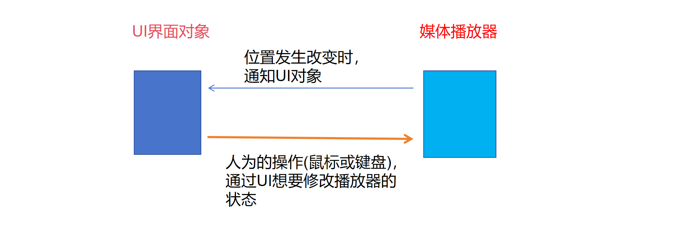

# Qt视频播放器项目实战

# 项目规划

我们可以先观察一下QQ影音播放器的界面布局效果图：


通过以上分析，我们大致了解了播放器需要进行分解的部分，那接下来就是动手的时候啦！！！~ 
视频播放器项目涉及的模块可以主要分为以下几个部分：

> 1. 自定义视频播放窗体
> 2. 实现`libvlc`播放功能
> 3. 添加进度条、音量调节功能
> 4. 自定义标题栏
> 5. 实现无边框窗口拉伸功能
> 6. 自定义视频打开按钮
> 7. 自定义底部控制栏窗口
> 8. 添加右侧播放列表
> 9. 实现双击播放功能

# VLC简介

`VLC`是一款功能强大且免费开源的多媒体播放器，以下是关于它的简单介绍：

- **基本信息**：`VLC`媒体播放器最初由法国的`VideoLAN`团队开发，支持多种操作系统，包括Windows、Mac OS、Linux等，甚至在移动设备的安卓和`iOS`系统上也能使用。
- **功能特点**
    - **格式支持广泛**：能播放几乎所有常见的音频和视频格式，如`MP4`、`AVI`、`MKV`、`MP3`、`FLAC`等，还能播放流媒体、`DVD`、`VCD`等，无需安装额外的解码器。
    - **播放性能出色**：具有高效的解码能力，播放高清甚至`4K`视频也能保持流畅，并且支持硬件加速，可减轻`CPU`负担。
    - **功能丰富多样**：支持字幕加载、音视频同步调整、播放速度调节、屏幕截图等功能，还可作为服务器进行流媒体广播。
- **界面特点**：`VLC`的界面简洁直观，易于操作。即使是初次使用的用户也能快速上手，找到播放、暂停、快进、快退等常用功能按钮。同时，它还支持皮肤更换，用户可以根据自己的喜好来定制界面外观。
- **应用场景**
    - **日常媒体播放**：适合普通用户在电脑或移动设备上播放本地视频和音频文件。
    - **专业场景应用**：在一些专业领域，如视频编辑、音频制作等工作中，也常被用于临时播放和预览素材。
    - **教育与培训**：在学校和培训机构中，教师可以使用VLC播放教学视频，方便地控制播放进度和添加字幕等。

VLC以其强大的功能、广泛的兼容性和简洁的操作界面，成为了一款深受用户喜爱的多媒体播放器，无论是普通用户还是专业人士，都能从它的众多功能中受益。

# VLC的下载、安装和使用

VLC的下载链接：http://download.videolan.org/pub/videolan/vlc/

这里我们已经下载好了，大家可以直接使用


建议大家直接使用`win32`位版本即可。解压后，打开目录文件，可以看到以下目录结构：


因为`VLC`本身就是一个开源播放器，所以双击`vlc.exe`可执行程序，就可以打开该播放器，选择文件就可以进行播放了，大家可以自行试用一下，这里就不再过多赘述了。


重要的是我们要学会使用`VLC`提供的`SDK`来做开发。接下来，我们就开始研究它的具体事宜步骤了。

# `VLC`播放视频的基本步骤

我们先通过一个基本的视频播放步骤，来测试一下`VLC`的`sdk`的使用。先设计一个简单的界面，如下图所示。


在界面上一共有4个button和一个播放视频的Widget


为了引入`libvlc`的库，我们需要先将`VLC`的目录整个拷贝到工程目录下：


我们还需要在Qt项目中的 .pro文件中的最末尾，换行加入以下三句

```shell
INCLUDEPATH += ./vlc-3.0.8-win32/sdk/include
LIBS += $$PWD/vlc-3.0.8-win32/sdk/lib/libvlc.lib
LIBS += $$PWD/vlc-3.0.8-win32/sdk/lib/libvlccore.lib
```


接下来，我们先来了解一下`VLC`播放视频的基本步骤：

> 1、初始化`VLC`库
>
> 2、创建媒体对象
>
> 3、创建媒体播放器
>
> 4、控制播放
>
> 5、事件监听
>
> 6、释放资源

重要的数据类型

1、`libvlc_instance_t`  ，这是`vlc`实例

2、`libvlc_media_t`，这是媒体对象

3、`libvlc_media_player_t`，这是媒体播放器


## `libvlc_new`函数

`libvlc_new` 是 `VLC` 媒体播放器的 `C` 语言接口 `libvlc` 库中的一个重要函数，用于创建一个新的 `VLC` 实例。

### 函数原型

```c
libvlc_instance_t *libvlc_new(int argc, const char *const *argv);
```

> 参数：
>
> - `argc`
>
>   - 类型为 `int`，表示 `argv` 数组中参数的数量。它指定了传递给 `VLC` 实例的命令行参数的个数。
>   - 当不需要传递额外的命令行参数时，可将其设置为 `0`。
>
> - `argv`
>
>   - 类型为 `const char *const *`，是一个指向字符串数组的指针，该数组包含了传递给 `VLC` 实例的命令行参数。
>   - 这些参数类似于在命令行中运行 VLC 时使用的选项，例如设置日志级别、禁用某些功能等。每个参数都是一个以空字符结尾的字符串。
>   - 如果不需要传递额外的命令行参数，可将其设置为 `NULL`。
>
> 返回值：
>
> - 如果函数调用成功，将返回一个指向新创建的 `libvlc_instance_t` 类型的指针，该指针代表了一个 `VLC` 实例。
> - 如果函数调用失败（例如内存分配失败），则返回 NULL。


## `libvlc_media_new_path`函数

`libvlc_media_new_path` 是 `VLC` 的 `C` 语言库 `libvlc` 中的一个函数，用于根据文件路径创建一个媒体对象。

### 函数原型

```c
libvlc_media_t *libvlc_media_new_path(libvlc_instance_t *instance, const char *psz_path);
```

> 参数：
>
> - `instance`：类型为 `libvlc_instance_t *`，是通过 `libvlc_new` 函数创建的 `VLC` 实例指针。它代表了一个 `VLC` 应用程序实例，所有与媒体相关的操作都需要在这个实例的上下文中进行。
> - `psz_path`：
>   类型为 `const char *`，是要创建媒体对象的文件路径。这个路径可以是绝对路径，也可以是相对路径。如果是相对路径，那么它是相对于当前工作目录的路径。该路径必须指向一个有效的媒体文件，如视频文件（.mp4、.avi 等）或音频文件（.mp3、.wav 等），否则创建媒体对象可能会失败。
>
> 返回值：
>
> - 成功时，返回一个指向新创建的 `libvlc_media_t` 类型的指针，该指针代表了指定路径的媒体文件。这个媒体对象可以用于后续的操作，如播放、暂停、获取媒体信息等。
> - 失败时，返回 `NULL`。可能的失败原因包括路径无效、文件不存在、无法访问文件或者 `VLC` 内部错误等。


## `libvlc_media_player_new_from_media`函数

`libvlc_media_player_new_from_media` 是 `VLC` 的 C 语言接口 `libvlc` 库中的一个重要函数，用于根据已有的媒体对象创建一个媒体播放器对象。

### 函数原型

```c
libvlc_media_player_t *libvlc_media_player_new_from_media(libvlc_media_t *p_md);
```

> 参数：
>
> - `p_md`：类型为 `libvlc_media_t *`，是一个指向已创建的媒体对象的指针。这个媒体对象通常是通过 `libvlc_media_new_path`、`libvlc_media_new_location` 等函数创建的，代表了一个具体的媒体资源，如视频文件、音频文件或网络流等。
>
> 返回值：
>
> - 若函数调用成功，会返回一个指向新创建的 `libvlc_media_player_t` 类型的指针，该指针代表了一个媒体播放器对象。利用这个媒体播放器对象，你可以对关联的媒体资源进行播放、暂停、停止等操作。
> - 若函数调用失败（例如内存分配失败等），则返回 NULL。


## `libvlc_media_player_set_hwnd`函数

`libvlc_media_player_set_hwnd` 是 `VLC` 的 `libvlc` 库中用于在 Windows 平台上指定媒体播放器渲染视频的窗口句柄的函数。

### 函数原型

```c
void libvlc_media_player_set_hwnd(libvlc_media_player_t *p_mi, void *drawable);
```

> 参数：
>
> - `p_mi`：类型为 `libvlc_media_player_t *`，是一个指向媒体播放器对象的指针。这个媒体播放器对象通常是通过 `libvlc_media_player_new_from_media` 等函数创建的，代表了一个可以对媒体资源进行播放、暂停等操作的播放器实例。
> - `drawable`：类型为 `void *`，实际上它应该是一个 `Windows` 窗口句柄（HWND 类型）。在 Windows 编程中，每个窗口都有一个唯一的句柄，用于标识该窗口。通过将这个窗口句柄传递给 `libvlc_media_player_set_hwnd` 函数，VLC 媒体播放器会将视频渲染到这个指定的窗口中。


## `libvlc_media_player_get_state`函数

`libvlc_media_player_get_state` 是 `VLC` 的 `libvlc` 库中的一个函数，用于获取媒体播放器当前的状态。

### 函数原型：

```c
libvlc_state_t libvlc_media_player_get_state(const libvlc_media_player_t *p_mi);
```

> 参数：
>
> - p_mi：类型为 `const libvlc_media_player_t *`，是一个指向媒体播放器对象的常量指针。此媒体播放器对象通常通过 `libvlc_media_player_new_from_media` 等函数创建，代表着一个可对媒体资源执行播放、暂停等操作的播放器实例。
>
> 返回值：
>
> - 该函数返回一个 `libvlc_state_t` 类型的枚举值，用以表示媒体播放器当前的状态。`libvlc_state_t` 枚举类型的可能取值及含义如下：
>   `libvlc_NothingSpecial`：播放器处于初始状态，尚未开始加载或播放任何媒体。
>   `libvlc_Opening`：播放器正在尝试打开指定的媒体资源，比如正在连接网络流或者读取本地文件。
>   `libvlc_Buffering`：播放器正在缓冲媒体数据，这通常在网络播放或者读取大文件时发生。
>   `libvlc_Playing`：媒体正在正常播放。
>   `libvlc_Paused`：播放已暂停。
>   `libvlc_Stopped`：播放已停止，播放器回到初始状态。
>   `libvlc_Ended`：媒体播放结束，到达了文件末尾或者流的结束位置。
>   `libvlc_Error`：播放过程中出现了错误，可能是文件损坏、网络问题等原因导致。


## `libvlc_media_player_play`函数

`libvlc_media_player_play` 是 `VLC` 的 `libvlc` 库中用于启动媒体播放的核心函数。

### 函数原型

```c
int libvlc_media_player_play(libvlc_media_player_t *p_mi);
```

> 参数：
>
> - `p_mi`:类型为 `libvlc_media_player_t *`，是一个指向媒体播放器对象的指针。这个媒体播放器对象通常是通过 `libvlc_media_player_new_from_media` 函数创建的，代表了一个可以对特定媒体资源进行播放控制的实例。
>
> 返回值：
>
> - 返回值为 0：表示媒体播放成功启动。不过，这并不意味着媒体已经开始实际播放，因为播放器可能还处于打开、缓冲等前期准备阶段。
> - 返回值为 -1：表示播放启动失败。失败的原因可能有多种，例如媒体文件不存在、文件损坏、网络连接问题、资源不足等。


## `libvlc_media_player_stop`函数

`libvlc_media_player_stop` 是 `VLC` 的 `libvlc` 库中的一个函数，用于停止正在播放的媒体。

### 函数原型

```c
void libvlc_media_player_stop ( libvlc_media_player_t *p_mi );
```

> 参数：
>
> - p_mi：类型为 `libvlc_media_player_t *`，是一个指向媒体播放器对象的指针。这个媒体播放器对象通常是通过 `libvlc_media_player_new_from_media` 函数创建的，代表着一个可以对特定媒体资源进行播放控制的实例。


## `libvlc_media_player_pause` 函数

`libvlc_media_player_pause` 是 `VLC` 的 `libvlc` 库中用于暂停或恢复媒体播放的函数。

### 函数原型

```c
int libvlc_media_player_pause(libvlc_media_player_t *p_mi);
```

> 参数：
>
> - p_mi：类型为 `libvlc_media_player_t *`，是一个指向媒体播放器对象的指针。这个媒体播放器对象通常是通过 `libvlc_media_player_new_from_media` 函数创建的，代表着一个可以对特定媒体资源进行播放控制的实例。


## `QDir::toNativeSeparators`函数

`QDir::toNativeSeparators` 是 Qt 框架中用于路径处理的一个静态函数，其主要功能是将路径中的通用分隔符（如斜杠 /）转换为当前操作系统所使用的原生路径分隔符。

#### 函数原型

```c++
QString QDir::toNativeSeparators(const QString &path)
```

>  参数说明
>
> - path：类型为 `const QString &`，表示需要进行转换的路径字符串。这个路径可以是绝对路径，也可以是相对路径。
> 
> 返回值
> - 返回一个 `QString` 类型的字符串，该字符串是将输入路径中的通用分隔符（如斜杠 /）转换为当前操作系统所使用的原生路径分隔符后的结果。


## `VLCWidget.h`头文件

```c++
#ifndef VLCWIDGET_H
#define VLCWIDGET_H

#include <QWidget>
#include <vlc/vlc.h>

QT_BEGIN_NAMESPACE
namespace Ui { class VLCWidget; }
QT_END_NAMESPACE

class VLCWidget : public QWidget
{
    Q_OBJECT

public:
    VLCWidget(QWidget *parent = nullptr);
    ~VLCWidget();

private slots:
    void on_btnOpen_clicked();
    void on_btnPlayer_clicked();
    void on_btnPause_clicked();
    void on_btnStop_clicked();

private:
    Ui::VLCWidget *ui;
    libvlc_instance_t *         _pinstance = nullptr;
    libvlc_media_player_t *     _pmediaPlayer = nullptr;
    libvlc_media_t *            _pmedia = nullptr;
};
#endif // VLCWIDGET_H
```


## `VLCWidget.cpp`实现文件

```c++
#include "VLCWidget.h"
#include "ui_VLCWidget.h"

#include <QDebug>
#include <QFileDialog>
#include <QMessageBox>

VLCWidget::VLCWidget(QWidget *parent)
    : QWidget(parent)
    , ui(new Ui::VLCWidget)
    , _pinstance(nullptr)
    , _pmediaPlayer(nullptr)
    , _pmedia(nullptr)
{
    ui->setupUi(this);
}

VLCWidget::~VLCWidget()
{
    delete ui;

    libvlc_media_release(_pmedia);
    libvlc_media_player_release(_pmediaPlayer);
    libvlc_release(_pinstance);
    qDebug() << "~VLCWidget()";
}

void VLCWidget::on_btnOpen_clicked()
{
    qDebug() << "on_btnOpen_clicked";
    QString filename = QFileDialog::getOpenFileName(this, "请选择视频文件", "D:/",
                                                    "视频文件(*.mp4);;"
                                                    "视频文件(*.avi);;");
    qDebug() << "filename:" << filename;
    if(filename.isEmpty()) {
        return;
    }
    //注意:这一步必须要做,否则就会有bug
    filename = QDir::toNativeSeparators(filename);
    qDebug() << "filename:" << filename;
    const char* vlc_args[] = {
        //"--no-plugins-cache",    // 禁用插件缓存（若问题仍存在则关闭）
        "--ignore-config",       // 忽略全局配置文件
        "--quiet",               // 静默模式（减少日志）
        "--no-video-title-show", // 禁用标题显示
        //"--avcodec-hw=any"       // 启用硬件加速（可选）
    };
    //1.初始化vlc实例
    _pinstance = libvlc_new(sizeof(vlc_args)/sizeof(vlc_args[0]), vlc_args);
    if(!_pinstance) {
        QMessageBox::information(this, "提示", "libvlc_new failed!");
        exit(EXIT_FAILURE);
    }

    //2. 设置媒体路径
    _pmedia = libvlc_media_new_path(_pinstance, filename.toStdString().c_str());
    //3.初始化mediaplayer
    _pmediaPlayer = libvlc_media_player_new_from_media(_pmedia);
    if(!_pmediaPlayer) {
        libvlc_release(_pinstance);
        QMessageBox::information(this, "提示", "libvlc_media_player_new_from_media failed!");
        exit(EXIT_FAILURE);
    }
    //4. 设置播放的窗口句柄
    libvlc_media_player_set_hwnd(_pmediaPlayer, (void*)ui->videoWidget->winId());

    QMessageBox::information(this, "已加载好文件", "请点击播放按钮");
}

void VLCWidget::on_btnPlayer_clicked()
{
    qDebug() << "on_btnPlayer_clicked";
    //5.开始播放
    libvlc_state_t state = libvlc_media_player_get_state(_pmediaPlayer);
    qDebug() << "state: " << state;
    if(state == libvlc_Paused ||
        state == libvlc_Stopped ||
        state == libvlc_NothingSpecial)
    {
        libvlc_media_player_play(_pmediaPlayer);
    }
}

void VLCWidget::on_btnPause_clicked()
{
    qDebug() << "on_btnPause_clicked";
    //6. 暂停播放
    libvlc_state_t state = libvlc_media_player_get_state(_pmediaPlayer);
    if(state == libvlc_Playing) {
        libvlc_media_player_pause(_pmediaPlayer);
    }
    //libvlc_media_player_pause(_pmediaPlayer);
}

void VLCWidget::on_btnStop_clicked()
{
    qDebug() <<"on_btnStop_clicked";
    //7.停止播放
    libvlc_state_t state = libvlc_media_player_get_state(_pmediaPlayer);
    if(state == libvlc_Playing || state == libvlc_Paused)
    {
        libvlc_media_player_stop(_pmediaPlayer);
    }
}
```

## 编译后无法运行的bug解决方案

在编译之后，进行运行时，可能会出现无法运行的情况。那该怎么解决呢？

在我们之前下载的`sdk`目录中有以下几个文件


此时只需要在编译好的debug目录中添加它们即可。


# `VLC`事件管理器

## `libvlc_media_player_event_manage`函数

`libvlc_media_player_event_manager` 是 `VLC` 的 `libvlc` 库中的一个函数，用于获取**媒体播放器**的事件管理器。

#### 函数原型

```c
libvlc_event_manager_t *libvlc_media_player_event_manager(const libvlc_media_player_t *p_mi);
```

> 参数：
>
> - p_mi：类型为 const libvlc_media_player_t *，是一个指向媒体播放器对象的常量指针。这个媒体播放器对象通常是通过 libvlc_media_player_new_from_media 或 libvlc_media_player_new 函数创建的，代表了一个可以对媒体资源进行播放控制的实例。
>
> 返回值：
>
> - 若函数调用成功，会返回一个指向 libvlc_event_manager_t 类型的指针，该指针代表了媒体播放器的事件管理器。通过这个事件管理器，你可以注册和监听媒体播放器的各种事件，如播放状态变化、时间更新等。
> - 若函数调用失败（例如传入的媒体播放器指针无效），则返回 NULL。

该函数的主要作用是获取媒体播放器的事件管理器，以便你可以注册回调函数来监听媒体播放器的各种事件。通过监听这些事件，你可以实时了解媒体播放的状态，并根据状态变化做出相应的处理，例如更新 UI 显示、记录播放历史等。


## `libvlc_event_attach`函数

libvlc_event_attach 是 VLC 的 libvlc 库中的一个函数，用于注册事件回调函数，以便在特定事件发生时执行自定义操作。

#### 函数原型

```c
int libvlc_event_attach(libvlc_event_manager_t *p_em,
                        libvlc_event_type_t i_event_type,
                        void (*f_callback)(const libvlc_event_t *p_event, void *p_user_data),
                        void *p_user_data);
```

> 参数：
>
> - p_em：类型为 libvlc_event_manager_t ，是一个指向事件管理器的指针。这个事件管理器通常是通过 libvlc_media_player_event_manager、libvlc_media_event_manager 等函数获取的，代表了一个可以监听特定类型事件的管理器。
> - i_event_type：
>   类型为 libvlc_event_type_t，是一个枚举值，表示要监听的事件类型。VLC 提供了多种事件类型，例如媒体播放器的状态变化事件、媒体解析完成事件等。常见的事件类型包括：
>   libvlc_MediaPlayerPlaying：媒体开始播放
>   libvlc_MediaPlayerPaused：媒体暂停
>   libvlc_MediaPlayerStopped：媒体停止
>   libvlc_MediaPlayerEndReached：媒体播放结束
>   libvlc_MediaPlayerEncounteredError：播放过程中出现错误
> - f_callback：
>   类型为函数指针 void (*)(const libvlc_event_t *, void *)，是一个回调函数，当指定的事件发生时会被调用。该回调函数接受两个参数：
>   - p_event：类型为 const libvlc_event_t *，是一个指向事件结构体的指针，包含了事件的详细信息。
>   - p_user_data：类型为 void *，是用户自定义数据，在注册回调函数时传入，并在回调函数被调用时传递给回调函数。
> - p_user_data：
>   类型为 void *，是用户自定义数据，可以是任意类型的指针。这个数据会在回调函数被调用时传递给回调函数，通常用于传递上下文信息或其他需要在回调函数中使用的数据。
>
> 返回值：
>
> - 返回值为 0：表示事件回调函数注册成功。
> - 返回值为 -1：表示事件回调函数注册失败。可能的原因包括事件管理器无效、事件类型不支持等。


## `libvlc_event_e`枚举类型

```c
enum libvlc_event_e {
    /* Append new event types at the end of a category.
     * Do not remove, insert or re-order any entry.
     * Keep this in sync with lib/event.c:libvlc_event_type_name(). */
    libvlc_MediaMetaChanged=0,
    libvlc_MediaSubItemAdded,
    libvlc_MediaDurationChanged,
    libvlc_MediaParsedChanged,
    libvlc_MediaFreed,
    libvlc_MediaStateChanged,
    libvlc_MediaSubItemTreeAdded,

    libvlc_MediaPlayerPlaying,
    libvlc_MediaPlayerPaused,
    libvlc_MediaPlayerStopped,
    libvlc_MediaPlayerForward,
    libvlc_MediaPlayerBackward,
    libvlc_MediaPlayerPositionChanged,

    libvlc_MediaPlayerAudioVolume,
    libvlc_MediaPlayerAudioDevice,
};
```


## `on_btnOpen_clicked()`函数

在`void VLCWidget::on_btnOpen_clicked()`函数中添加以下代码

```c++
void VLCWidget::on_btnOpen_clicked()
{	
    //......
	//5. 设置播放器的事件注册管理器
    _peventManager = libvlc_media_player_event_manager(_pmediaPlayer);
    if(_peventManager) {
        libvlc_event_attach(_peventManager,
                            libvlc_MediaPlayerPositionChanged,
                            vlc_callback,
                            this);
        libvlc_event_attach(_peventManager,
                            libvlc_MediaPlayerAudioVolume,
                            vlc_callback,
                            this);
        qDebug() << "event_manger set over!!!";
    }

    //获取媒体的总时间
    if(_pmedia) {
        libvlc_media_parse(_pmedia);
        _durationSec = libvlc_media_get_duration(_pmedia) / 1000;
        qDebug() << "total time: " << _durationSec;
    }
}
```


## 回调函数vlc_callback

```c
static void vlc_callback( const struct libvlc_event_t *p_event, void *p_data )
{
    qDebug() << "vlc_callback...";
    VLCWidget * p = static_cast<VLCWidget*>(p_data);
    if(p) {
        switch (p_event->type) {
        case libvlc_MediaPlayerPositionChanged:
        {
            //获取到的是一个百分比
            float pos = libvlc_media_player_get_position(p->media_player());
            p->setTimeSliderValue(pos * 100);
            //设置视频的时间
            qint64 totalSec = p->durationTime();
            qDebug() << "duration time:" << totalSec;
            int HH = totalSec / 3600;
            int MM = (totalSec - HH * 3600) / 60;
            int SS = totalSec - HH *3600 - MM * 60;

            qint64 curSec = libvlc_media_player_get_time(p->media_player()) / 1000;
            int curHour = curSec / 3600;
            int curMinute = (curSec - curHour * 3600) / 60;
            int curSecs = curSec - curHour * 3600 - curMinute * 60;
            char buff[64] = {0};
            sprintf(buff, "%02d:%02d:%02d/%02d:%02d:%02d",
                    curHour, curMinute, curSecs,
                    HH, MM, SS);

            QString str(buff);
            p->setTimeText(str);
            break;
        }
        case libvlc_MediaPlayerAudioVolume:
        {
            int val = libvlc_audio_get_volume(p->media_player());
            p->setVolumeSliderValue(val);
            break;
        }
        }
    }
}
```


## 实现效果：


# 封装`VLC`库


根据我们的需求，我们将`VLC`的常用操作封装到一个类`VLCKits`中，其头文件的实现如下：

### `VLCKits.h`头文件

```c++
#ifndef VLCKITS_H
#define VLCKITS_H

#include <QObject>
#include <vlc/vlc.h>

class VLCKits : public QObject
{
    Q_OBJECT
public:
    explicit VLCKits(QObject *parent = nullptr);
    ~VLCKits();

    bool initVLC();
    bool play(const QString & name, void * hwnd);
    void play();
    void pause();
    void stop();
    void setVolume(int value);
    void setPosition(int value);
    
    libvlc_media_player_t * mediaPlayer() const { return _pMediaPlayer;   }
    libvlc_time_t durations() const {   return _totalSec;   }
	
    //当需要修改UI界面的显示时，通过信号来触发，以下三个函数调用时就触发信号
    void setTimeSliderPos(int value);
    void setTimeText(const QString & str);
    void setVolumePos(int value);

signals://自定义信号
    void sigTimeSliderPos(int value);
    void sigTimeText(const QString & str);
    void sigVolumeSliderPos(int value);

private:
    libvlc_instance_t *         _pInstance = nullptr;
    libvlc_media_t *            _pMedia = nullptr;
    libvlc_media_player_t *     _pMediaPlayer = nullptr;
    libvlc_event_manager_t *    _pEventManager = nullptr;
    libvlc_time_t _totalSec = 0;//一个文件的总时间
};

#endif // VLCKITS_H
```

### `VLCKits.cpp`实现文件

```c++
#include "VLCKits.h"
#include <QDebug>

VLCKits::VLCKits(QObject *parent) : QObject(parent)
{}

VLCKits::~VLCKits() {
    libvlc_media_player_release(_pMediaPlayer);
    libvlc_media_release(_pMedia);
    libvlc_release(_pInstance);
}

static void processPosition(VLCKits * pkits)
{
    //百分比
    float pos = libvlc_media_player_get_position(pkits->mediaPlayer());
    pkits->setTimeSliderPos(pos * 100);

    libvlc_time_t totalSecs = pkits->durations();
    //qDebug() << "total secs: " << totalSecs;
    libvlc_time_t curSecs = libvlc_media_player_get_time(pkits->mediaPlayer()) / 1000;
    //qDebug() << "cur secs: " << curSecs;
    int hh = curSecs / 3600;
    int mm = curSecs % 3600 / 60;
    int ss = curSecs % 60;
    int HH = totalSecs / 3600;
    int MM = totalSecs % 3600 / 60;
    int SS = totalSecs % 60;
    char buff[64] = {0};
    sprintf(buff, "%02d:%02d:%02d/%02d:%02d:%02d",
            hh, mm, ss, HH, MM, SS);
    QString str(buff);
    pkits->setTimeText(str);
}

static void processVolume(VLCKits * pkits)
{
    int val = libvlc_audio_get_volume(pkits->mediaPlayer());
    qDebug() << "volume:" << val;
    if(val == -1) {
        return;
    }
    pkits->setVolumePos(val);
}

static void vlc_callback( const struct libvlc_event_t *p_event, void *p_data )
{
    VLCKits * pkits = static_cast<VLCKits*>(p_data);
    if(pkits) {
        switch(p_event->type) {
        case libvlc_MediaPlayerPositionChanged://播放位置变化时
            processPosition(pkits); break;
        case libvlc_MediaPlayerAudioVolume://音量变化时
            processVolume(pkits); break;
        }
    }
}

bool VLCKits::initVLC()
{
    _pInstance = libvlc_new(0, nullptr);
    if(_pInstance) {
        _pMediaPlayer = libvlc_media_player_new(_pInstance);
        if(_pMediaPlayer) {
            _pEventManager = libvlc_media_player_event_manager(_pMediaPlayer);
            if(_pEventManager) {
                //注册媒体播放器的事件处理器
                //1. 位置发生改变时
                libvlc_event_attach(_pEventManager, libvlc_MediaPlayerPositionChanged,
                                    vlc_callback, this);
                //2. 声音变化时
                libvlc_event_attach(_pEventManager, libvlc_MediaPlayerAudioVolume,
                                    vlc_callback, this);
                return true;
            } else {
                libvlc_media_player_release(_pMediaPlayer);
                libvlc_release(_pInstance);
                return false;
            }
        } else {
            libvlc_release(_pInstance);
            return false;
        }
    } else {
        return false;
    }
}

bool VLCKits::play(const QString &name, void *hwnd)
{
    //1. 设置媒体
    _pMedia = libvlc_media_new_path(_pInstance, name.toStdString().c_str());
    if(!_pMedia) {
        return false;
    }
    //得到了媒体文件后
    //2. 解析文件
    libvlc_media_parse(_pMedia);
    _totalSec = libvlc_media_get_duration(_pMedia) / 1000;

    //3. 设置媒体播放器
    libvlc_media_player_set_media(_pMediaPlayer, _pMedia);

    //4. 设置播放窗口句柄
    libvlc_media_player_set_hwnd(_pMediaPlayer, hwnd);
    //5. 播放视频
    int ret = libvlc_media_player_play(_pMediaPlayer);
    if(ret < 0) {
        return false;
    } else
        return true;
}

void VLCKits::play()
{
    libvlc_state_t state = libvlc_media_player_get_state(_pMediaPlayer);
    if(state == libvlc_Paused ||
        state == libvlc_Stopped) {
        libvlc_media_player_play(_pMediaPlayer);
    }
}

void VLCKits::pause()
{
    libvlc_state_t state = libvlc_media_player_get_state(_pMediaPlayer);
    if(state == libvlc_Playing) {
        libvlc_media_player_pause(_pMediaPlayer);
    }
}

void VLCKits::stop()
{
    libvlc_state_t state = libvlc_media_player_get_state(_pMediaPlayer);
    if(state == libvlc_Playing ||
        state == libvlc_Paused) {
        libvlc_media_player_stop(_pMediaPlayer);
        //重置进度条的位置
        emit sigTimeSliderPos(0);
    }
}

void VLCKits::setTimeSliderPos(int value)
{   //发送信号
    emit sigTimeSliderPos(value);
}

void VLCKits::setTimeText(const QString &str)
{   //发送信号
    emit sigTimeText(str);
}

void VLCKits::setVolumePos(int value)
{
    emit sigVolumeSliderPos(value);
}

void VLCKits::setVolume(int value)
{
    libvlc_audio_set_volume(_pMediaPlayer, value);
}

void VLCKits::setPosition(int value)
{
    libvlc_media_player_set_position(_pMediaPlayer, value / 100.0);
}
```


# 注意几个问题

## 0. 请认真阅读文档


## 1. 消息通信机制

在实现代码时，要注意Qt的UI对象与vlc对象之间通信时，应该是单向的，别做成**死循环**了。



Slider的控制

> sliderMoved	**推荐使用**
>
> valueChanged    不推荐

## 2. 布局管理器

如果需要手动实现UI界面，建议对**每一个UI控件**都**显式设置父对象**，不要通过布局管理器隐式设置，防止忘记添加时，造成内存泄漏。如以下示例：

```c++
//头文件中
class CMainWindow
: public CFramelessWidget
{
    Q_OBJECT
public:
    explicit CMainWindow(QWidget * parent= nullptr);
    
protected:
    
private:
    void initUI();
    
signals:
    //...
private slots:
    //...
private:
    CTitleBar * _ptitleBar;
    // 不要放成员函数
};

//实现文件中
void CMainWindow::initUI()
{
    _ptitleBar = new CTitleBar(this);

    QWidget * wbody = new QWidget(this);
    wbody->setMinimumSize(800, 600);

    QVBoxLayout * pvLayout = new QVBoxLayout(this);
    pvLayout->addWidget(_ptitleBar);
    pvLayout->addWidget(wbody);
    pvLayout->setContentsMargins(0, 0, 0, 0);
}
```

## 3. 代码风格

**注意代码风格，注意代码风格，注意代码风格**！！！

**注意缩进，缩进，缩进**！！！


# 全屏播放

在Qt的`QWidget`类中有全屏和退出全屏的函数

```c++
bool isFullScreen() const;//是否全屏
void showFullScreen();//全屏
void showNormal();//退出全屏
```

我们可以通过鼠标双击窗体来达到全屏的效果，也可以通过按ESC键来退出全屏播放，分别需要重定义以下两个函数。

```c++
void VLCWidget::mouseDoubleClickEvent(QMouseEvent *event)
{
    if(this->isFullScreen()) {
        this->showNormal();
    } else{
        this->showFullScreen();
    }
}

void VLCWidget::keyPressEvent(QKeyEvent *event)
{
    if(event->key() == Qt::Key_Escape) {
        this->showNormal();
    }
}
```

但在播放视频时，这里有一个`bug`：**当鼠标移动到播放视频的窗口中时，会自动消失，且无法再响应鼠标的双击操作，从而导致鼠标双击操作失效**，鼠标操作都被`libvlc`内部处理了。

在Windows平台，可以借用windows的技术来处理这个问题。在Windows的`API`中有一个`EnableWindow`的函数，加载`windows.h`头文件可以使用该函数。

```c++
WINBOOL WINAPI EnableWindow(HWND hWnd,WINBOOL bEnable);
```

该函数的作用：启用或者禁用鼠标和键盘对指定窗口或控件的输入。禁用输入时，窗口不会接收鼠标单击和按键等输入；启用输入时，窗口将接收所有输入。


具体的策略为：

在播放视频时，创建一个Windows的定时器，在定时器的回调函数中处理窗口消息的禁用与启用。当禁用后，关闭定时器。

### `SetTimer`函数

添加windows的头文件`windows.h`

```c++
UINT_PTR SetTimer(
  HWND    hWnd,
  UINT_PTR nIDEvent,
  UINT    uElapse,
  TIMERPROC lpTimerFunc
);
```

> 参数：
>
> - `hWnd`：指定与定时器关联的窗口句柄。如果此参数为 NULL，则定时器将在系统消息队列中创建，并且不能使用 KillTimer 函数来销毁定时器，而必须使用 PostQuitMessage 函数来退出定时器所在的线程。
> - `nIDEvent`：指定定时器的标识符。如果指定了 lpTimerFunc 参数，那么这个值可以为 NULL 或者 0。如果 lpTimerFunc 为 NULL，那么这个值必须是一个非零的整数，用于唯一标识定时器。
> - `uElapse`：指定定时器的时间间隔，以毫秒为单位。当定时器到期时，系统会向关联的窗口发送 WM_TIMER 消息或者调用指定的回调函数。
> - `lpTimerFunc`：指定一个指向定时器回调函数的指针。如果此参数为 NULL，那么定时器到期时，系统会向 hWnd 窗口发送 WM_TIMER 消息。如果不为 NULL，则系统会调用指定的回调函数来处理定时器事件。
>
> 返回值
>
> - 如果函数成功，返回值是新定时器的标识符（`nIDEvent` 参数的值），如果指定了 `lpTimerFunc` 参数，返回值是一个非零的整数。
> - 如果函数失败，返回值为 0。可以调用 `GetLastError` 函数来获取更多的错误信息。

`TIMERPROC`的原型为：

```c++
  typedef VOID (CALLBACK *TIMERPROC) (HWND, UINT, UINT_PTR, DWORD);
```

以上函数原型是 Windows 定时器回调函数的原型，其中各参数的含义如下：

> - `HWND hwnd`: 关联定时器的窗口句柄。若创建定时器时 SetTimer 的 hWnd 参数为 NULL，此参数也为 NULL。
> - `UINT uMsg`: 固定为 WM_TIMER，表示这是一个定时器消息。
> - `UINT_PTR idEvent`: 定时器的标识符，即 `SetTimer` 中指定的 `nIDEvent` 值（若 `SetTimer` 的 `nIDEvent` 为 0，则此参数为系统生成的非零标识符）。
> - `DWORD dwTime`: 系统启动后的毫秒数（相当于 `GetTickCount` 的返回值），表示定时器触发的时间点。


### `FindWindowEx`函数

在 Windows 编程中，`FindWindowEx` 函数用于查找特定的窗口句柄，它可以根据窗口类名、窗口标题以及父子关系来定位窗口。

#### 函数原型

```c++
HWND FindWindowEx(
  HWND hwndParent,    // 父窗口句柄
  HWND hwndChildAfter,// 从哪个子窗口之后开始查找
  LPCTSTR lpszClass,  // 窗口类名（可为NULL）
  LPCTSTR lpszWindow  // 窗口标题（可为NULL）
);
```

> 参数：
>
> - **`hwndParent`**：指定要查找子窗口的父窗口句柄。若为 `NULL`，则函数以桌面窗口为父窗口，查找顶级窗口。
>
> - **`hwndChildAfter`**：指定从哪个子窗口之后开始查找（按 Z 序排列）。若为 `NULL`，则从第一个子窗口开始查找。
>
> - **`lpszClass`**：指定窗口的类名（通过 `RegisterClass` 注册的名称）。若为 `NULL`，则忽略类名，仅根据标题查找。
>
> - **`lpszWindow`**：指定窗口的标题文本（即窗口标题栏显示的内容）。若为 `NULL`，则忽略标题，仅根据类名查找。
>
> 返回值：
>
> - 若找到匹配的窗口，返回该窗口的句柄（`HWND`）。
> - 若未找到，返回 `NULL`。


### `EnumChildWindows` 函数

在 Windows 编程中，`EnumChildWindows` 是一个非常重要的函数，它的主要作用是枚举某个父窗口的所有子窗口。

#### 函数原型

```c++
BOOL EnumChildWindows(
  HWND    hWndParent,
  WNDENUMPROC lpEnumFunc,
  LPARAM  lParam
);
```

> 参数：
>
> - **`hWndParent`**：这是一个必需的参数，表示父窗口的句柄。函数会枚举这个父窗口下的所有子窗口。需要注意的是，子窗口是指那些直接以该窗口为父窗口的窗口，而不是所有后代窗口。
> - **`lpEnumFunc`**：这是一个指向回调函数的指针，该回调函数的原型为 `BOOL CALLBACK EnumChildProc(HWND hwnd, LPARAM lParam)`。在枚举过程中，系统会为每个子窗口调用一次这个回调函数。
> - **`lParam`**：这是一个用户定义的参数，会被传递给回调函数。可以利用这个参数传递一些自定义的数据，比如结构体指针、计数器等。
>
> 返回值：
>
> - 如果函数执行成功，返回值为 `TRUE`。
> - 如果函数执行失败，返回值为 `FALSE`。可以通过调用 `GetLastError` 函数来获取具体的错误信息。


具体实现如下：

```c++
// VLCWidget.cpp
#include <windows.h>
BOOL CALLBACK EnumVLC(HWND hwnd, LPARAM lParam)
{
    TCHAR szTitle[1024];

    int nLen = GetWindowText(hwnd, szTitle, 1024);
    
    if (nLen > 0)
    {
        EnableWindow(hwnd, FALSE);
        KillTimer(NULL, 1);
    }

    return TRUE;
}

void CALLBACK TimeProc(HWND hwnd, UINT msg, UINT_PTR id, DWORD time)
{
    HWND vlcHwnd = FindWindowEx(NULL, NULL, NULL, L"王道播放器");

    if (vlcHwnd)
    {
        EnumChildWindows(vlcHwnd, EnumVLC, NULL);
    }
}

void VLCWidget::on_openButton_clicked()
{
    QString filename = QFileDialog::getOpenFileName(this, "请选择视频文件", "D:\\videos",
                                                    "视频文件(*.mp4);;"
                                                    "视频文件(*.avi);;"
                                                    "视频文件(*.mkv);;");
    if(filename.isEmpty())
        return;
    //这一句不能少
    filename = QDir::toNativeSeparators(filename);
    bool ret = _pVLCKits->play(filename, (void*)ui->videoWidget->winId());
    if(!ret) {
        QMessageBox::information(this, "提示", "播放文件失败");
        return;
    }

    //Windows头文件中的定时器函数
    int nret = SetTimer(NULL, 1, 300, TimeProc);
    //EnableWindow();//启用和禁用窗口接收事件
}
```


# 添加播放列表

几个重要的类型

> libvlc_media_list_t 
>
> libvlc_media_list_player_t     
>
> 

### `libvlc_media_list_player_new`函数

`libvlc_media_list_player_new` 是 `VLC` 的 `libvlc` 库中的一个函数，用于创建一个新的媒体列表播放器对象。

#### 函数原型

```c
libvlc_media_list_player_t *libvlc_media_list_player_new(libvlc_instance_t *p_instance);
```

> 参数：
>
> - `p_instance`：类型为 `libvlc_instance_t *`，是一个指向 VLC 实例的指针。这个 VLC 实例通常是通过 `libvlc_new` 函数创建的，代表了一个 VLC 应用程序实例，所有与媒体相关的操作都需要在这个实例的上下文中进行。
>
> 返回值：
>
> - 若函数调用成功，会返回一个指向新创建的 libvlc_media_list_player_t 类型的指针，该指针代表了一个媒体列表播放器对象。通过这个媒体列表播放器对象，你可以管理和播放一系列媒体文件。
> - 若函数调用失败（例如内存分配失败等），则返回 NULL。

### `libvlc_media_list_new`函数

libvlc_media_list_new 是 VLC 的 libvlc 库中的一个函数，用于创建一个新的媒体列表对象。

函数原型

```c
libvlc_media_list_t *libvlc_media_list_new(libvlc_instance_t *p_instance);
```

> 参数：
>
> - p_instance: 类型为 `libvlc_instance_t *`，是一个指向 VLC 实例的指针。这个 VLC 实例通常是通过 `libvlc_new` 函数创建的，代表了一个 VLC 应用程序实例，所有与媒体相关的操作都需要在这个实例的上下文中进行。
>
> 返回值：
>
> - 若函数调用成功，会返回一个指向新创建的 `libvlc_media_list_t` 类型的指针，该指针代表了一个媒体列表对象。通过这个媒体列表对象，你可以添加、删除和管理多个媒体资源。
> - 若函数调用失败（例如内存分配失败等），则返回 `NULL`。


### libvlc_media_list_player_set_media_list 函数

libvlc_media_list_player_set_media_list 是 VLC 的 libvlc 库中的一个函数，用于将媒体列表（libvlc_media_list_t）关联到媒体列表播放器（libvlc_media_list_player_t）。

#### 函数原型

```c++
void libvlc_media_list_player_set_media_list(libvlc_media_list_player_t *p_mi,
                                               libvlc_media_list_t *p_ml);
```

> 参数：
>
> - `p_mi`：类型为 `libvlc_media_list_player_t *`，是一个指向媒体列表播放器对象的指针。这个媒体列表播放器对象通常是通过 `libvlc_media_list_player_new` 函数创建的，用于管理和播放一系列媒体文件。
> - `p_ml`：类型为 `libvlc_media_list_t *`，是一个指向媒体列表对象的指针。这个媒体列表对象包含了一个或多个媒体资源（`libvlc_media_t`），可以通过 `libvlc_media_list_new` 创建并使用 `libvlc_media_list_add_media` 添加媒体项。

该函数的主要作用是将一个预先创建好的媒体列表与媒体列表播放器关联起来，使得播放器可以按照指定的顺序或模式（如循环、随机播放）依次播放列表中的媒体文件。关联后，你可以使用媒体列表播放器的相关函数（如 `libvlc_media_list_player_play`）来控制整个列表的播放行为。


### libvlc_media_list_player_set_media_player函数

libvlc_media_list_player_set_media_player 是 VLC 的 libvlc 库中的一个函数，用于将一个普通的媒体播放器（libvlc_media_player_t）与媒体列表播放器（libvlc_media_list_player_t）关联起来。

#### 函数原型

```c
void libvlc_media_list_player_set_media_player(libvlc_media_list_player_t *p_mi,
                                                 libvlc_media_player_t *p_mp);
```

该函数的主要作用是将一个**普通的媒体播放器**与**媒体列表播放器**关联起来，使得媒体列表播放器在播放媒体列表中的**各个媒体项**时，能够使用指定的媒体播放器进行播放。这样做的好处是，**你可以对媒体播放器进行自定义设置**（如设置视频输出窗口、调整音频参数等），然后将这些设置应用到整个媒体列表的播放过程中。


### libvlc_media_list_player_set_playback_mode 函数

libvlc_media_list_player_set_playback_mode 是 VLC 的 libvlc 库中的一个函数，用于设置媒体列表播放器的播放模式。

#### 函数原型

```c
void libvlc_media_list_player_set_playback_mode(libvlc_media_list_player_t *p_mi,
                                                  libvlc_playback_mode_t e_mode);
```

> 参数：
>
> - p_mi：类型为 libvlc_media_list_player_t *，是一个指向媒体列表播放器对象的指针。这个媒体列表播放器对象通常是通过 libvlc_media_list_player_new 函数创建的，用于管理和播放一系列媒体文件。
> - e_mode：类型为 libvlc_playback_mode_t，是一个枚举值，表示要设置的播放模式。libvlc_playback_mode_t 枚举类型的可能取值有：
>   - libvlc_playback_mode_default：默认播放模式，播放完列表中的所有媒体后停止。
>   - libvlc_playback_mode_loop：循环播放模式，播放完列表中的所有媒体后，会从头开始重新播放。
>   - libvlc_playback_mode_repeat：重复播放模式，会不断重复播放当前正在播放的媒体，直到手动切换到下一个媒体。


### `VLCKits.h`头文件

```c++
#ifndef VLCKITS_H
#define VLCKITS_H

#include <QObject>
#include <vlc/vlc.h>
#include <vector>
using std::vector;

class VLCKits : public QObject
{
    Q_OBJECT
public:
	//添加的成员函数
    bool play(const QStringList & names, void * hwnd);
 
    void addMediaIndex();
    int currentIndex() const {  return _currentIndex;   }
    const vector<libvlc_time_t> & durationArr() const
    {   return _durationArr;    }

private:
    libvlc_instance_t *         _pInstance = nullptr;
    libvlc_media_t *            _pMedia = nullptr;
    libvlc_media_player_t *     _pMediaPlayer = nullptr;
    libvlc_event_manager_t *    _pEventManager = nullptr;
    //libvlc_time_t _totalSec = 0;

    //添加的数据成员
    libvlc_media_list_player_t * _pMediaListPlayer = nullptr;
    libvlc_media_list_t *        _pMediaList = nullptr;
    vector<libvlc_time_t>       _durationArr;
    int _currentIndex = -1;//表示当前播放的媒体下标
};

#endif // VLCKITS_H

```


### `VLCKits.cpp`实现文件

```c++
static void processVolume(VLCKits * pkits)
{
    int val = libvlc_audio_get_volume(pkits->mediaPlayer());
    qDebug() << ">>> volume:" << val;
    if(val == -1) {
        return;
    }
    pkits->setVolumePos(val);
}

static void processMediaChanged(VLCKits* pkits)
{
    qDebug() << ">>>>> processMediaChanged()";
    pkits->addMediaIndex();
}

static void vlc_callback( const struct libvlc_event_t *p_event, void *p_data )
{
    VLCKits * pkits = static_cast<VLCKits*>(p_data);
    if(pkits) {
        switch(p_event->type) {
        case libvlc_MediaPlayerPositionChanged://播放位置变化时
            processPosition(pkits); break;
        case libvlc_MediaPlayerAudioVolume://音量变化时
            processVolume(pkits); break;
        case libvlc_MediaPlayerMediaChanged://播放的媒体变化时
            processMediaChanged(pkits); break;
        }
    }
}

bool VLCKits::initVLC()
{
    _pInstance = libvlc_new(0, nullptr);
    if(_pInstance) {
        _pMediaPlayer = libvlc_media_player_new(_pInstance);
        if(_pMediaPlayer) {
            _pEventManager = libvlc_media_player_event_manager(_pMediaPlayer);
            if(_pEventManager) {
                //注册媒体播放器的事件处理器
                //1. 位置发生改变时
                libvlc_event_attach(_pEventManager, libvlc_MediaPlayerPositionChanged,
                                    vlc_callback, this);
                //2. 声音变化时
                libvlc_event_attach(_pEventManager, libvlc_MediaPlayerAudioVolume,
                                    vlc_callback, this);
                //3. 媒体改变时(添加的代码)
                libvlc_event_attach(_pEventManager, libvlc_MediaPlayerMediaChanged,
                                    vlc_callback, this);
                return true;
            } else {
                libvlc_media_player_release(_pMediaPlayer);
                libvlc_release(_pInstance);
                return false;
            }
        } else {
            libvlc_release(_pInstance);
            return false;
        }
    } else {
        return false;
    }
}

bool VLCKits::play(const QStringList &names, void *hwnd)
{
    //设置列表播放器
    _pMediaListPlayer = libvlc_media_list_player_new(_pInstance);
    if(!_pMediaListPlayer) {
        return false;
    }
    _pMediaList = libvlc_media_list_new(_pInstance);
    if(!_pMediaList) {
        return false;
    }
    for(int i = 0; i < names.size(); ++i) {
        QString filename = names[i];
        filename = QDir::toNativeSeparators(filename);
        _pMedia = libvlc_media_new_path(_pInstance, filename.toStdString().c_str());
        if(!_pMedia) {
            return false;
        }
        //将媒体添加到播放列表中
        libvlc_media_list_add_media(_pMediaList, _pMedia);
        //解析媒体元数据
        libvlc_media_parse(_pMedia);
        libvlc_time_t durationSecs = libvlc_media_get_duration(_pMedia) / 1000;
        _durationArr.push_back(durationSecs);
        libvlc_media_release(_pMedia);
    }

    //列表播放器关联媒体列表
    libvlc_media_list_player_set_media_list(_pMediaListPlayer, _pMediaList);
    //设置播放模式：列表循环播放
    libvlc_media_list_player_set_playback_mode(_pMediaListPlayer, libvlc_playback_mode_loop);
    //媒体列表播放器关联媒体播放器(必须加)
    libvlc_media_list_player_set_media_player(_pMediaListPlayer, _pMediaPlayer);

    libvlc_media_player_set_hwnd(_pMediaPlayer, hwnd);//设置播放窗口
    libvlc_media_list_player_play(_pMediaListPlayer);//开始播放
    return true;
}

void VLCKits::addMediaIndex() {
    ++_currentIndex;
    _currentIndex %= _durationArr.size();
}
```


# 优化界面

项目进行到此，剩下的就是我们需要优化播放器的界面了。先来看看效果图：


### `qss.h`头文件

```c++
#pragma once
#include <string>
using namespace std;

string logo_button_qss = R"(
	QPushButton{
		background-color:rgb(54,54,54);
		border:none;
		font-family:Microsoft YaHei;
		font-size:18px; 
		color:rgb(255,255,255);
	}

	QPushButton::menu-indicator:open{
		image:url(:/titlebar/resources/titleBar/down_arrow.svg);
		subcontrol-position:right center;
		subcontrol-origin:padding;border:none;
	}

	QPushButton::menu-indicator:closed{
		image:url(:/titlebar/resources/titleBar/up_arrow.svg);
		subcontrol-position:right center;
		subcontrol-origin:padding;border:none;
	})";

string menu_qss = R"(
	QMenu{background-color:rgb(253,253,253);}
	QMenu::item{
		font:16px;
		background-color:rgb(253,253,253);
		padding:8px 32px;
		margin:0px 8px;
		border-bottom:1px solid #DBDBDB;}
		/*选择项设置*/
		QMenu::item:selected{background-color: #FFF8DC;})";

string minimode_qss = R"(
	QPushButton{
		background-image:url(:/titlebar/resources/titleBar/minimode.svg);
		border:none
	}

	QPushButton:hover{
		background-color:rgb(99, 99, 99);
		background-image:url(:/titlebar/resources/titleBar/minimode_hover.svg);
		border:none;
	}
)";

string settop_qss = R"(
	QPushButton{
		background-image:url(:/titlebar/resources/titleBar/settop.svg);
		border:none
	}

	QPushButton:hover{
		background-color:rgb(99, 99, 99);
		background-image:url(:/titlebar/resources/titleBar/settop_hover.svg);border:none;
	}
)";

string min_qss = R"(
	QPushButton{background-image:url(:/titlebar/resources/titleBar/min.svg);border:none}
		QPushButton:hover{
		background-color:rgb(99, 99, 99);
		background-image:url(:/titlebar/resources/titleBar/min_hover.svg);border:none;}
	)";

string max_qss = R"(
	QPushButton{background-image:url(:/titlebar/resources/titleBar/normal.svg);border:none}
				 QPushButton:hover{
				 background-color:rgb(99, 99, 99);
				 background-image:url(:/titlebar/resources/titleBar/normal_hover.svg);border:none;}
	)";

string close_qss = R"(
	QPushButton{background-image:url(:/titlebar/resources/titleBar/close.svg);border:none}
		QPushButton:hover{
		background-color:rgb(99, 99, 99);
		background-image:url(:/titlebar/resources/titleBar/close_hover.svg);border:none;}
	)";
```


# 菜单栏

在 Qt 中实现菜单栏可以通过`QMenuBar`和`QMenu`、`QAction`等类来完成。`QMenuBar `用于创建菜单栏，`QMenu` 用于创建菜单项中的子菜单，`QAction `则代表菜单中的具体操作项。以下是一个菜单的示意图。


### 1.`QMenuBar`

`QMenuBar` 是 Qt 中用于创建菜单栏的类，通常位于主窗口的顶部，用于组织和显示多个菜单。以下是`QMenuBar` 的一些常用操作：

```c++
//构造对象	
	explicit QMenuBar(QWidget *parent = nullptr);
//添加菜单
    QAction *addMenu(QMenu *menu);
    QMenu *addMenu(const QString &title);
    QMenu *addMenu(const QIcon &icon, const QString &title);
	
```

为了使用`QMenuBar`对象，必须将其设置到主窗口中，可以调用`QMainWindow`中的`setMenuBar`函数

```c++
    void setMenuBar(QMenuBar *menubar);
```

### 2.`QMenu`

`QMenu` 是 Qt 中用于创建菜单的类，它提供了丰富的操作来创建和管理菜单及其菜单项。以下是 `QMenu` 的一些常用操作：

```c++
//构造对象
    explicit QMenu(QWidget *parent = nullptr);
    explicit QMenu(const QString &title, QWidget *parent = nullptr);
//添加普通动作
    QAction *addAction(const QString &text);
    QAction *addAction(const QIcon &icon, const QString &text);
//添加分割线
    QAction *addSeparator();
//添加子菜单
    QAction *addMenu(QMenu *menu);
    QMenu *addMenu(const QString &title);
    QMenu *addMenu(const QIcon &icon, const QString &title);
//常见信号
Q_SIGNALS:
    void aboutToShow();
    void aboutToHide();
    void triggered(QAction *action);
    void hovered(QAction *action
                 
//显示菜单，exec函数会阻塞当前线程，直到用户关闭菜单
    QAction *exec();
    QAction *exec(const QPoint &pos, QAction *at = nullptr);
```


### 3.`QAction`

`QAction` 是 Qt 框架中用于表示用户界面中一个操作的类，它可以与菜单、工具栏按钮、快捷键等关联，使得在不同的交互方式下都能触发相同的操作逻辑。

```c++
//构造对象
	explicit QAction(QObject *parent = nullptr);
    explicit QAction(const QString &text, QObject *parent = nullptr);
    explicit QAction(const QIcon &icon, const QString &text, QObject *parent = nullptr);
//设置快捷键
    void setShortcut(const QKeySequence &shortcut);
```

示例：

```c++
    QMenuBar * pmenuBar = new QMenuBar(this);
    setMenuBar(pmenuBar);

    QMenu * fileMenu = pmenuBar->addMenu("文件");
    QAction * newAction = new QAction("新建", this);
    newAction->setShortcut(Qt::CTRL | Qt::Key_N);
    connect(newAction, &QAction::triggered, [=](){
        QMessageBox::information(this, "提示", "你点击了新建菜单");
    });
    fileMenu->addAction(newAction);
    fileMenu->addSeparator();//在菜单中设置分隔符

    QAction * openAction = new QAction("打开", this);
    fileMenu->addAction(openAction);
    connect(openAction, &QAction::triggered, [this](){
        QMessageBox::information(this, "提示", "你点击了打开菜单");
    });

    QMenu * editMenu = pmenuBar->addMenu("编辑");
    QAction * copyAction = new QAction("复制", this);
    connect(copyAction, &QAction::triggered, [=](){
        QMessageBox::information(this, "提示", "你点击了复制菜单");
    });
    editMenu->addAction(copyAction);

    QAction * pastAction = new QAction("粘贴", this);
    connect(pastAction, &QAction::triggered, [=](){
        QMessageBox::information(this, "提示", "你点击了粘贴菜单");
    });
    editMenu->addAction(pastAction);
```

效果图：


### 4.右键菜单（项目中用到）

以下为通过鼠标右键点击窗体的任意位置，呼唤出菜单的示例：

```c++
void Widget::initRightMenu2()
{
    _pmenu = new QMenu(this);
    auto pac1 = new QAction("复制");
    auto pac2 = new QAction("打开");
    _pmenu->addAction(pac1);
    _pmenu->addAction(pac2);

    setContextMenuPolicy(Qt::CustomContextMenu);
    connect(this, &QWidget::customContextMenuRequested, [=](const QPoint & pos){
        qDebug() << "right menu clicked:" << pos;
        _pmenu->exec(QCursor::pos());//ok 显示菜单
    });
}
```

**setContextMenuPolicy函数**

`setContextMenuPolicy` 函数是在 `QWidget` 类中定义的。`QWidget` 是 Qt 中所有用户界面对象的基类，这意味着几乎所有可以在界面上显示的控件，只要继承自 `QWidget`，都可以使用 `setContextMenuPolicy` 函数来设置上下文菜单策略，其原型如下：

```c++
void QWidget::setContextMenuPolicy(Qt::ContextMenuPolicy policy)
```

参数`policy`是一个枚举类型，用于指定不同的上下文菜单策略。

```c++
    enum ContextMenuPolicy {
        NoContextMenu,
        DefaultContextMenu,
        ActionsContextMenu,
        CustomContextMenu,
        PreventContextMenu
    };
```

- `NoContextMenu`： 控件不会显示上下文菜单。
- `DefaultContextMenu`： 使用默认的上下文菜单策略。对于大多数控件，默认情况下不会显示上下文菜单，除非控件本身实现了相应的上下文菜单处理逻辑。这个策略通常依赖于控件的具体实现和平台的默认行为。
- `ActionsContextMenu`：控件的上下文菜单将由其 `actions()` 列表中的动作（`QAction` 对象）组成。你可以通过 `addAction` 方法向控件添加动作，这些动作会在用户右键单击控件时显示在上下文菜单中。
- `CustomContextMenu`：控件会发射 `customContextMenuRequested `信号，你可以连接这个信号到自定义的槽函数，在槽函数中创建并显示自定义的上下文菜单。这允许你根据具体需求灵活地定义上下文菜单的内容和行为。
- `PreventContextMenu`: 阻止上下文菜单的显示，并且不会将上下文菜单事件传播给父控件。即使控件本身没有处理上下文菜单事件，其父控件也不会收到该事件，与 `NoContextMenu` 类似，但更强调阻止事件传播。

**示例效果：**


# 无边框窗口公用类设计

### 头文件`CFramelessWidget.h`

```c++
#ifndef CFRAMELESSWIDGET_H
#define CFRAMELESSWIDGET_H

#include <QWidget>

class CFramelessWidget : public QWidget
{
    Q_OBJECT

public:
    CFramelessWidget(QWidget *parent = nullptr);
    ~CFramelessWidget();
protected:
    bool nativeEvent(const QByteArray& eventType, void* message, long* result) override;

private:
    int m_nBorderWidth = 5;

};
#endif // CFRAMELESSWIDGET_H
```

### `CPP`文件`CFramelessWidget.cpp`

```c++
#include "CFramelessWidget.h"
#include <qt_windows.h>
#include <windows.h>
#include <windowsx.h>

CFramelessWidget::CFramelessWidget(QWidget *parent)
    : QWidget(parent)
{
    this->setWindowFlags(Qt::FramelessWindowHint | Qt::WindowMinMaxButtonsHint);
    setAttribute(Qt::WA_Hover);
}

CFramelessWidget::~CFramelessWidget()
{}

//该函数实现了窗口的拖拽拉伸
bool CFramelessWidget::nativeEvent(const QByteArray& eventType, void* message, long* result)
{
    MSG* param = static_cast<MSG*>(message);

    switch (param->message)
    {
    case WM_NCHITTEST:
    {
        int nX = GET_X_LPARAM(param->lParam) - this->geometry().x();
        int nY = GET_Y_LPARAM(param->lParam) - this->geometry().y();

        if (nX > m_nBorderWidth && nX < this->width() - m_nBorderWidth &&
            nY > m_nBorderWidth && nY < this->height() - m_nBorderWidth)
        {
            if (childAt(nX, nY) != nullptr)
                return QWidget::nativeEvent(eventType, message, result);
        }

        if ((nX > 0) && (nX < m_nBorderWidth))
            *result = HTLEFT;

        if ((nX > this->width() - m_nBorderWidth) && (nX < this->width()))
            *result = HTRIGHT;

        if ((nY > 0) && (nY < m_nBorderWidth))
            *result = HTTOP;

        if ((nY > this->height() - m_nBorderWidth) && (nY < this->height()))
            *result = HTBOTTOM;

        if ((nX > 0) && (nX < m_nBorderWidth) && (nY > 0)
            && (nY < m_nBorderWidth))
            *result = HTTOPLEFT;

        if ((nX > this->width() - m_nBorderWidth) && (nX < this->width())
            && (nY > 0) && (nY < m_nBorderWidth))
            *result = HTTOPRIGHT;

        if ((nX > 0) && (nX < m_nBorderWidth)
            && (nY > this->height() - m_nBorderWidth) && (nY < this->height()))
            *result = HTBOTTOMLEFT;

        if ((nX > this->width() - m_nBorderWidth) && (nX < this->width())
            && (nY > this->height() - m_nBorderWidth) && (nY < this->height()))
            *result = HTBOTTOMRIGHT;

        return true;
    }//end of case
    }//end of switch

    return false;
}
```

### 设置无边框窗口

```c++
this->setWindowFlags(Qt::FramelessWindowHint | Qt::WindowMinMaxButtonsHint);
```

这个函数中两个参数的作用就是设置无边框窗口。


`setAttribute(Qt::WA_Hover)`的作用是

是 Qt 框架中用于启用窗口部件（`QWidget`）悬停事件（hover events）的属性设置。当一个部件设置了这个属性后，它会接收鼠标悬停相关的事件，如鼠标进入、离开和在部件内移动时的事件，即使没有按下鼠标按钮。


### **`QWidget::nativeEvent`虚函数**

`QWidget::nativeEvent` 是 `QWidget` 类中的一个虚函数，它允许你直接处理底层的操作系统原生事件。在 Qt 应用程序中，事件通常是通过 Qt 的事件系统进行处理的，但有时你可能需要直接与底层操作系统的事件进行交互，例如处理 Windows 消息、X11 事件等，这时就可以重写 `nativeEvent` 函数。

**函数原型**

```c++
bool QWidget::nativeEvent(const QByteArray &eventType, void *message, long *result);
```
**参数说明**

- `eventType`: 一个 `QByteArray` 类型的参数，表示事件的类型。在不同的操作系统中，它的值会有所不同，例如在 Windows 下，它通常是 `"windows_generic_MSG"`。 
- `message`: 一个指向原生事件消息的指针。在 `Windows` 下，它是一个 `MSG` 结构体的指针；在 `X11` 下，它是一个 `XEvent` 结构体的指针。
- `result`：一个指向 `long` 类型的指针，用于存储事件处理的结果。在 Windows 下，它是消息处理函数的返回值

**返回值**

如果事件被处理并希望停止进一步的处理，返回 `true`；否则返回 `false`，让 Qt 继续处理该事件。

### **MSG结构体**

```c++
  typedef struct tagMSG {
    HWND hwnd;
    UINT message;
    WPARAM wParam;
    LPARAM lParam;
    DWORD time;
    POINT pt;
  } MSG,*PMSG,*NPMSG,*LPMSG;
```

- `hwnd`: 这是一个窗口句柄（`HWND` 类型），用于标识接收该消息的窗口。在 Windows 系统中，每个窗口都有一个唯一的句柄，通过这个句柄可以定位到具体的窗口对象。当消息被发送到系统时，系统会根据这个句柄将消息准确地传递给对应的窗口过程进行处理。

- `message`: 这是一个无符号整数（`UINT` 类型），代表消息的类型。Windows 系统定义了大量的消息类型，每个消息类型都有一个唯一的标识符。这些消息类型涵盖了各种用户操作和系统事件，例如鼠标点击、键盘输入、窗口大小改变等。常见的消息类型有 `WM_LBUTTONDOWN`（鼠标左键按下）、`WM_KEYDOWN`（键盘按键按下）等。

- `wParam`: 这是一个 `WPARAM` 类型的参数，通常用于传递与消息相关的附加信息，具体含义取决于消息的类型。`WPARAM` 是一个无符号整数类型，在不同的消息中它可能表示不同的内容，比如按键的虚拟键码、鼠标点击的状态等。

- `lParam`: 这是一个 `LPARAM` 类型的参数，同样用于传递与消息相关的附加信息。`LPARAM` 是一个长整型（在 32 位系统中是 32 位，在 64 位系统中是 64 位），它可以携带比 `wParam` 更复杂的信息，例如鼠标点击的坐标、窗口大小改变后的新尺寸等。**当该参数包含鼠标点击位置的屏幕坐标时，低 16 位表示 x 坐标，高 16 位表示 y 坐标。**可以通过以下代码获取坐标值：

  ```c++
  int xpos = GET_X_LPARAM(param->lParam);
  int ypos = GET_Y_LPARAM(param->lParam);
  ```

- `time`: 这是一个 `DWORD` 类型的参数，表示消息产生的时间，单位是毫秒。该时间是从系统启动开始计算的，通过这个字段可以了解消息产生的先后顺序和时间间隔，在一些需要处理时间相关逻辑的场景中非常有用，比如实现双击检测等功能。

- `pt`: 这是一个 `POINT` 结构体，包含两个成员 `x` 和 `y`，分别表示消息产生时鼠标的屏幕坐标。`x` 是水平坐标，`y` 是垂直坐标，通过这个字段可以知道鼠标在屏幕上的具体位置。

### `WM_NCHITTEST`

`WM_NCHITTEST`是message中的一种消息的类型，全称为`Non-Client Hit Test`，非客户区点击测试，是 Windows 系统在用户鼠标点击窗口时发送给窗口过程（`WindowProc`）的一条消息。其主要目的是**让窗口程序判断鼠标点击的具体位置是在窗口的哪个区域**，例如标题栏、边框、客户区、最小化按钮等，从而根据不同的区域做出相应的响应。

对于该消息的处理，一般有两种方式：

- 自定义窗口行为：通过处理 `WM_NCHITTEST` 消息，开发者可以自定义窗口的交互行为。比如，实现一个不规则形状的窗口，或者让窗口的某个特定区域具备特殊的功能。
- 窗口布局调整：可以根据鼠标点击的位置，动态调整窗口的大小和位置。例如，当用户点击窗口边框时，可以触发窗口的缩放操作。

**处理流程**

当窗口过程接收到 `WM_NCHITTEST` 消息时，需要返回一个表示点击区域的命中测试结果代码。常见的命中测试结果代码如下：

- **`HTCLIENT`**：表示鼠标点击在窗口的客户区（即窗口内部用于显示内容的区域）。
- **`HTCAPTION`**：表示鼠标点击在窗口的标题栏。
- **`HTLEFT`**、**`HTRIGHT`**、**`HTTOP`**、**`HTBOTTOM`**：分别表示鼠标点击在窗口的左、右、上、下边框。
- **`HTTOPLEFT`**、**`HTTOPRIGHT`**、**`HTBOTTOMLEFT`**、**`HTBOTTOMRIGHT`**：分别表示鼠标点击在窗口的左上角、右上角、左下角、右下角。
- **`HTMINBUTTON`**：表示鼠标点击在窗口的最小化按钮。
- **`HTMAXBUTTON`**：表示鼠标点击在窗口的最大化按钮。
- **`HTCLOSE`**：表示鼠标点击在窗口的关闭按钮。


### `QWidget::geometry()`函数

`QWidget::geometry()` 函数的核心作用是返回一个 `QRect` 对象，该对象包含了该 `QWidget` 相对于其父窗口的位置和大小信息。

- **x()**：矩形左上角的 x 坐标。
- **y()**：矩形左上角的 y 坐标。
- **width()**：矩形的宽度。
- **height()**：矩形的高度。

### `QWidget::childAt()`函数

`QWidget::childAt` 是 `QWidget` 类中的一个成员函数，其主要用途是根据给定的坐标点来查找该 `QWidget` 的子控件。下面从函数原型、参数、返回值、使用场景、示例代码等方面进行详细介绍。

```c++
QWidget *QWidget::childAt(int x, int y) const;
QWidget *QWidget::childAt(const QPoint &pos) const;
```

**参数说明**

- x和y：表示相对于当前 `QWidget` 坐标系的一个点的横、纵坐标。
- `pos`：是一个`QPoint`对象，同样表示相对于当前 `QWidget` 坐标系的一个点，`QPoint` 类封装了一个二维点的 `x` 和 `y` 坐标。

**返回值**

- 如果在指定的坐标位置存在该 `QWidget` 的子控件，则返回指向该子控件的指针。
- 如果指定坐标位置没有子控件，或者该位置的子控件是隐藏的，则返回 `nullptr`。


# 无边框窗口添加标题栏

### 展示效果


红色框框部分就是实现之后的效果图，一个标题栏

### 头文件`CTitleBar.h`

```c++
#ifndef CTITLEBAR_H
#define CTITLEBAR_H

#include <QWidget>
#include <QLabel>
#include <QPushButton>

class CTitleBar : public QWidget
{
    Q_OBJECT
public:
    explicit CTitleBar(QWidget *parent = nullptr);

signals:

private:
    void initUI();
    //鼠标按住标题栏时，进行窗体拖拽
    void mousePressEvent(QMouseEvent* event) override;

private:
    QLabel * _plogoLabel;
    QLabel * _ptitleTextLabel;
    QPushButton * _psetButton;
    QPushButton * _pminButton;
    QPushButton * _pmaxButton;
    QPushButton * _pcloseButton;
};

#endif // CTITLEBAR_H
```

### `CPP`文件`CTitleBar.cpp`

```c++
#include "CTitleBar.h"
#include <QHBoxLayout>
#include <windows.h>
#include <qt_windows.h>

CTitleBar::CTitleBar(QWidget *parent) : QWidget(parent)
{
    initUI();
}

void CTitleBar::initUI()
{
    //禁止父窗口影响子窗口样式,必须加上，否则样式不会起作用
    setAttribute(Qt::WA_StyledBackground);

    this->setFixedHeight(32 + 10);
    this->setStyleSheet("background-color:rgb(54,54,54)");

    _plogoLabel = new QLabel(this);
    _plogoLabel->setFixedSize(32,32);
    _plogoLabel->setStyleSheet(
            "background-image:url(:/resources/titlebar/title_icon.png);border:none");

    _ptitleTextLabel = new QLabel(this);
    _ptitleTextLabel->setText("我是标题");
    _ptitleTextLabel->setFixedWidth(120);
    _ptitleTextLabel->setStyleSheet(
            "QLabel{font-family: Microsoft YaHei;"
                "font-size:18px;"
                "color:#BDC8E2;background-color:rgb(54,54,54);}");

    _psetButton = new QPushButton(this);
    _psetButton->setFixedSize(32, 32);
    _psetButton->setStyleSheet(
            "QPushButton{background-image:url(:/resources/titlebar/set.svg);border:none}"
            "QPushButton:hover{"
                    "background-color:rgb(99, 99, 99);"
                    "background-image:url(:/resources/titlebar/set_hover.svg);border:none;}");

    _pminButton = new QPushButton(this);
    _pminButton->setFixedSize(32, 32);
    _pminButton->setStyleSheet(
            "QPushButton{background-image:url(:/resources/titlebar/min.svg);border:none}"
            "QPushButton:hover{"
                    "background-color:rgb(99, 99, 99);"
                    "background-image:url(:/resources/titlebar/min_hover.svg);border:none;}");

    _pmaxButton = new QPushButton(this);
    _pmaxButton->setFixedSize(32, 32);
    _pmaxButton->setStyleSheet(
            "QPushButton{background-image:url(:/resources/titlebar/max.svg);border:none}"
            "QPushButton:hover{"
                    "background-color:rgb(99, 99, 99);"
                    "background-image:url(:/resources/titlebar/max_hover.svg);border:none;}");

    _pcloseButton = new QPushButton(this);
    _pcloseButton->setFixedSize(32, 32);
    _pcloseButton->setStyleSheet(
            "QPushButton{background-image:url(:/resources/titlebar/close.svg);border:none}"
            "QPushButton:hover{"
                    "background-color:rgb(99, 99, 99);"
                    "background-image:url(:/resources/titlebar/close_hover.svg);border:none;}");

    QHBoxLayout * phLayout = new QHBoxLayout(this);
    phLayout->addWidget(_plogoLabel);
    phLayout->addWidget(_ptitleTextLabel);
    phLayout->addStretch();//添加一个弹簧

    phLayout->addWidget(_psetButton);

//  QSpacerItem* pItem1 = new QSpacerItem(20, 20, QSizePolicy::Fixed, QSizePolicy::Fixed);
//  phLayout->addSpacerItem(pItem1);

    phLayout->addWidget(_pminButton);

//  QSpacerItem* pItem2 = new QSpacerItem(18, 20, QSizePolicy::Fixed, QSizePolicy::Fixed);
//  phLayout->addSpacerItem(pItem2);

    phLayout->addWidget(_pmaxButton);

//  QSpacerItem* pItem3 = new QSpacerItem(18, 20, QSizePolicy::Fixed, QSizePolicy::Fixed);
//  phLayout->addSpacerItem(pItem3);

    phLayout->addWidget(_pcloseButton);
    phLayout->setContentsMargins(5,5,5,5);
    //this->setLayout(phLayout);
    
    connect(_pminButton, &QPushButton::clicked, this, &CTitleBar::onClickedSlot);
    connect(_pmaxButton, &QPushButton::clicked, this, &CTitleBar::onClickedSlot);
    connect(_pcloseButton, &QPushButton::clicked, this, &CTitleBar::onClickedSlot);
}

void CTitleBar::mousePressEvent(QMouseEvent* event)
{
    if (ReleaseCapture())
    {
        QWidget* pWindow = this->window();//返回指向标题栏所属顶层窗口的指针。
        if (pWindow->isTopLevel()) //判断该窗口是否为顶层窗口（即独立窗口）
        {
            SendMessage(HWND(pWindow->winId()), WM_SYSCOMMAND, SC_MOVE + HTCAPTION, 0);
        }
    }
}
```

### CTitleBar::mousePressEvent函数解析

该函数表示当鼠标在标题栏区域按下时会自动调用该函数。该函数的工作原理：

> 1. 当用户在标题栏按下鼠标时，Qt 捕获鼠标事件并调用此函数。
> 2. 通过`ReleaseCapture()`释放 Qt 对鼠标的控制，将控制权转交给 Windows 系统。
> 3. 向窗口发送`WM_SYSCOMMAND`消息，告知系统用户正在拖动标题栏，触发窗口的移动逻辑。
> 4. Windows 系统接收到消息后，自动处理窗口的移动操作。

RealeaseCapture函数是WindowsAPI函数，用于释放当前线程中Qt对鼠标的捕获状态。

SendMessage函数是Windows API 函数，用于向窗口发送消息。其参数作用如下：

> - `HWND(pWindow->winId())`将 Qt 窗口 ID 转换为 Windows 窗口句柄。
> - `WM_SYSCOMMAND`表示系统命令消息。
> - `SC_MOVE + HTCAPTION`组合值表示**拖动窗口标题栏的操作**（`HTCAPTION`表示鼠标位于标题栏区域）。


### `QWidget::setAttribute()`函数

`setAttribute` 是 `QWidget` 类的一个成员函数，其作用是**设置或清除指定的窗口部件属性**。该函数原型如下：

```c++
void QWidget::setAttribute(Qt::WidgetAttribute attribute, bool on = true);
```

**参数说明**

- `attribute`：这是一个 `Qt::WidgetAttribute` 类型的枚举值，用于指定要设置或清除的属性。
- `on`：一个布尔值，默认为 `true`。如果为 `true`，则设置该属性；如果为 `false`，则清除该属性。

**`Qt::WidgetAttribute`**

- `Qt::WA_StyledBackground` 是 `Qt::WidgetAttribute` 枚举类型中的一个值，表示是否允许使用样式表来绘制窗口部件的背景。**当设置了这个属性后，窗口部件会根据应用的样式表来绘制其背景**；如果没有设置该属性，窗口部件默认不会使用样式表来绘制背景。

### `QSpacerItem`类

`QSpacerItem` 是 Qt 中用于在布局中创建空白间隔区域的类，它可以帮助你更灵活地控制界面元素的布局和间距。通常与布局管理器（如 `QVBoxLayout`、`QHBoxLayout` 等）一起使用。

**创建对象**

```c++
QSpacerItem(int w, int h, QSizePolicy::Policy hPolicy = QSizePolicy::Minimum, 
            QSizePolicy::Policy vPolicy = QSizePolicy::Minimum);
```

**参数说明**

- `w`：间隔项的初始宽度。
- `h`：间隔项的初始高度。
- `hPolicy`：水平方向的大小策略，默认为 `QSizePolicy::Minimum`。
- `vPolicy`：垂直方向的大小策略，默认为 `QSizePolicy::Minimum`。

`QSizePolicy::Policy` 定义了间隔项在布局中的大小行为，常见的取值有：

- **`QSizePolicy::Minimum`**：间隔项会尽可能小，仅占用必要的空间。
- **`QSizePolicy::Fixed`**：间隔项的大小固定，不会随布局变化而改变。
- **`QSizePolicy::Expanding`**：间隔项会尽可能多地占据可用空间，挤压其他元素。
- **`QSizePolicy::MinimumExpanding`**：间隔项有一个最小大小，同时可以扩展以填充多余的空间。

### `addSpacerItem()`函数

`addSpacerItem` 是布局管理器（如 `QHBoxLayout`、`QVBoxLayout` 等）的成员函数，但它需要先创建一个 `QSpacerItem` 对象，然后将该对象添加到布局中。`QSpacerItem` 对象可以自定义初始的宽度、高度以及水平和垂直方向的大小策略，使用起来相对复杂一些，但提供了更高的灵活性。

```c++
void addSpacerItem(QSpacerItem *spacerItem);
```

### `addStrech()`函数

`addStretch` 也是布局管理器（如 `QHBoxLayout`、`QVBoxLayout `等）的成员函数。它直接在布局中添加一个可伸缩的空白区域，使用起来较为简洁，只需要调用该函数并传入一个伸缩因子（默认值为 0）即可。

```c++
void addStretch(int stretch = 0);
```

**参数说明**

- `stretch`：伸缩因子，是一个整数，默认值为 0。伸缩因子决定了该伸缩区域在布局中占据多余空间的相对比例。当布局中有多个伸缩区域或者界面元素时，它们会按照各自的伸缩因子来分配多余的空间。例如，如果有两个伸缩区域，伸缩因子分别为 1 和 2，那么在分配多余空间时，第二个伸缩区域会得到第一个伸缩区域两倍的空间。


### 实现最小化、最大化、关闭窗口功能

在CTitleBar::initUI函数的末尾添加以下三行代码，完成信号和槽函数的绑定。

```c++
    connect(_pminButton, &QPushButton::clicked, this, &CTitleBar::onClickedSlot);
    connect(_pmaxButton, &QPushButton::clicked, this, &CTitleBar::onClickedSlot);
    connect(_pcloseButton, &QPushButton::clicked, this, &CTitleBar::onClickedSlot);
```

在`CTitleBar.cpp`文件中，添加槽函数`onClickedSlot`

```c++
void CTitleBar::onClickedSlot()
{
    QPushButton * pbtn = qobject_cast<QPushButton*>(sender());
    QWidget * pwindow = this->window();
    if(pbtn == _pminButton) {
        pwindow->showMinimized();
    } else if(pbtn == _pmaxButton) {
        if(pwindow->isMaximized()) {
            pwindow->showNormal();
            _pmaxButton->setStyleSheet(
                    "QPushButton{background-image:url(:/resources/titlebar/normal.svg);border:none}"
                    "QPushButton:hover{"
                            "background-color:rgb(99, 99, 99);"
                            "background-image:url(:/resources/titlebar/normal_hover.svg);border:none;}");
        } else  {
            pwindow->showMaximized();
            _pmaxButton->setStyleSheet(
                    "QPushButton{background-image:url(:/resources/titlebar/max.svg);border:none}"
                    "QPushButton:hover{"
                            "background-color:rgb(99, 99, 99);"
                            "background-image:url(:/resources/titlebar/max_hover.svg);border:none;}");
        }
    } else if(pbtn == _pcloseButton) {
        emit sigClose();//发射信号，通知父窗口关闭
    }
}
```


### 鼠标双击全屏

```c++

void MainWidget::mouseDoubleClickEvent(QMouseEvent* event)
{
    if (this->isFullScreen())
    {
        this->showNormal();
    }
    else
    {
        this->showFullScreen();
    }
}
```

### 按ESC键退出全屏

```c++
void MainWidget::keyPressEvent(QKeyEvent* event)
{
    if (event->key() == Qt::Key_Escape)
    {
        if (this->isFullScreen())
        {
            this->showNormal();
        }
    }
}
```


### 头文件`CMainWindow.h`

```c++
#ifndef CMAINWINDOW_H
#define CMAINWINDOW_H

#include "CFramelessWidget.h"
#include "CTitleBar.h"


class CMainWindow
: public CFramelessWidget
{
    Q_OBJECT
public:
    explicit CMainWindow(QWidget * parent= nullptr);

private slots:
    void closeSlot();//与子对象CTitleBar::sigClose信号绑定

private:
    void initUI();

private:
    CTitleBar * _ptitleBar;//主窗口中包含标题栏
};

#endif // CMAINWINDOW_H
```

### `CPP`文件`CMainWindow.cpp`

```c++
#include "CMainWindow.h"
#include <QVBoxLayout>
#include <QMessageBox>

CMainWindow::CMainWindow(QWidget * parent)
    : CFramelessWidget(parent)
{
    initUI();
}

void CMainWindow::closeSlot()
{
    QMessageBox::StandardButton isExit = QMessageBox::warning(this, "提示", "你确定要退出吗？",
            QMessageBox::Yes | QMessageBox::No, QMessageBox::Yes);
    if(isExit == QMessageBox::Yes) {
        close();
    }
}

void CMainWindow::initUI()
{
    _ptitleBar = new CTitleBar(this);

    QWidget * wbody = new QWidget(this);
    wbody->setMinimumSize(800, 600);

    QVBoxLayout * pvLayout = new QVBoxLayout(this);
    pvLayout->addWidget(_ptitleBar);
    pvLayout->addWidget(wbody);
    pvLayout->setContentsMargins(0, 0, 0, 0);
    connect(_ptitleBar, &CTitleBar::sigClose, this, &CMainWindow::closeSlot);
}
```


# 按钮菜单的设计

初步展示效果图1


初步展示效果图2


### `CPP`文件`Widget.cpp`

```c++
Widget::Widget(QWidget *parent)
    : QWidget(parent)
    , ui(new Ui::Widget)
{
    ui->setupUi(this);

    QMenu * fileMenuItems = new QMenu;
    fileMenuItems->setIcon(QIcon(":/resources/file.png"));
    fileMenuItems->setTitle("文件");

    QList<QAction *> fileAcList;
    QAction * openFileAc = new QAction(QIcon(":/resources/file.png"), "打开文件", this);
    openFileAc->setShortcut(QKeySequence("Ctrl+8"));// 设置快捷键

    QAction * openFolderAc = new QAction("打开文件夹", this);
    QAction * openUrlAc = new QAction("打开url", this);
    fileAcList << openFileAc << openFolderAc << openUrlAc;
    fileMenuItems->addActions(fileAcList);//添加二级子菜单

    QMenu * menu = new QMenu;//主菜单
    menu->addMenu(fileMenuItems);//添加一级子菜单

    QAction * playAc = new QAction(QIcon(":/resources/play.png"), "播放", this);
    QAction * toolsAc = new QAction(QIcon(":/resources/tools.png"), "工具", this);
    menu->addAction(playAc);
    menu->addAction(toolsAc);
    menu->addSeparator();//添加分隔线

    QMenu * setMenuItems = new QMenu;
    setMenuItems->setTitle("设置");
    setMenuItems->setIcon(QIcon(":/resources/set.png"));

    QList<QAction*> setAcList;
    QAction * sysSetAc = new QAction("系统设置", this);
    QAction * playSetAc = new QAction("播放设置", this);
    QAction * captionSetAc = new QAction("字幕设置", this);
    setAcList << sysSetAc << playSetAc << captionSetAc;
    setMenuItems->addActions(setAcList);
    menu->addMenu(setMenuItems);

    menu->addSeparator();//添加分隔线

    QAction * exitAc = new QAction(QIcon(":/resources/exit.png"), "退出", this);
    menu->addAction(exitAc);

    //设置样式表
    string menu_qss = R"(
        QMenu::item
        {
             font:16px;
             background-color:rgb(25,253,253);
             padding:8px 32px;
             margin:28px 8px;
             border-bottom:1px solid #FF0000;
        }

        /*选择项设置*/
        QMenu::item:selected
        {
             background-color: #00FF00;
        }
    )";
    menu->setStyleSheet(QString::fromStdString(menu_qss));

    ui->pushButton->setMenu(menu);//在按钮上设置菜单

    //绑定信号与槽
    connect(openFileAc, &QAction::triggered, [=]{
        QString fileName = QFileDialog::getOpenFileName(this,
                                                        "请选择视频文件",
                                                        "D:/",
                                                        "视频(*.mp4);;"
                                                        "视频(*.avi);;");
        if(fileName.isEmpty()) {
            return;
        }
    });
}
```

### 设置按钮菜单样式表

头文件`qss.h`

```c++
#ifndef QSS_H
#define QSS_H

#include <string>

using std::string;

string buttonQss = R"(
    QPushButton
    {
        font:18px "Microsoft YaHei";
        color:rgb(255,255,255);
        border:none
    }

    QPushButton::menu-indicator:open
    {
        image:url(:/resources/down_arrow.svg);
        subcontrol-position:right center;
        subcontrol-origin:padding;border:none;
    }

    QPushButton::menu-indicator:closed
    {
        image:url(:/resources/up_arrow.svg);
        subcontrol-position:right center;
        subcontrol-origin:padding;border:none;
    }
)";

string menuQss = R"(
    QMenu
    {
        background-color:rgb(53, 63, 73);
    }

    QMenu::item
    {
         font:16px;
         color:white;
         background-color:rgb(53, 63, 73);
         padding:8px 32px;
         margin:8px 8px;
         /*border-bottom:1px solid #DBDBDB;  item底部颜色*/
    }

    /*选择项设置*/
    QMenu::item:selected
    {
         background-color:rgb(54, 54, 54);
    }
)";

string menuItemQss = R"(
    QMenu
    {
        background-color:rgb(73, 73, 73);
    }

    QMenu::item
    {
         font:16px;
         color:white;
         background-color:rgb(73, 73, 73);
         padding:8px 32px;
         margin:8px 8px;
         /*border-bottom:1px solid #DBDBDB;  item底部颜色*/
    }

    /*选择项设置*/
    QMenu::item:selected
    {
         background-color:rgb(54, 54, 54);
    }
)";

#endif // QSS_H
```

### `CPP`文件`Widget.cpp`更新

```c++
Widget::Widget(QWidget *parent)
    : QWidget(parent)
    , ui(new Ui::Widget)
{
    ui->setupUi(this);
    //...
	ui->pushButton->setText("王道影音");
    ui->pushButton->setFixedSize(120, 64);
    ui->pushButton->setMenu(menu);//在按钮上设置菜单

    ui->pushButton->setStyleSheet(QString::fromStdString(buttonQss));
    menu->setStyleSheet(QString::fromStdString(menuQss));//设置样式表
    fileMenuItems->setStyleSheet(QString::fromStdString(menuItemQss));//设置样式表
    setMenuItems->setStyleSheet(QString::fromStdString(menuItemQss));//设置样式表
        
}
```

设置样式表之后的效果图如下：


# 绘制音量控制界面

为了解决声音音量的可视化控制，我们可以通过绘制一个自定义按钮，来实现想要的效果。绘制自定义界面外观的常见方法有以下两种：

1. 覆盖`paintEvent()`函数， 在其中使用`QPainter`对象完成界面的绘制。
2. 覆盖`paintEvent()`函数，在其中使用`QStyle`类绘制函数。

我们这里选择第二种方法，通常`QStyle`类的绘制函数需要如下4个参数：

- 一个`QStyle`枚举值，用于指定需要绘制什么类型的图形元素。
- 一个`QStyleOption`或其子类对象（样式选项），样式选项包含额了需要绘制的图形元素的所有信息，比如包含了图形元素的文本、调色板等。根据绘制的内容，样式需要不同的样式选项类，比如`QStyle::CE_PushButton`元素，需要一个`QStyleOptionButton`类型的参数。
- 一个用于绘制图形的`QPainter`对象或者其子类对象，比如`QStylePainter`.
- 一个用于执行绘制的`QWidget`, 通常是需要绘制的元素的控件。


那我们先从执行绘制的`QWidget`的定义开始，在这里我们定义一个`CVolumeDialog`类

### 头文件 `CVolumeDialog.h`

```c++
#ifndef CVOLUMESLIDERDIALOG_H
#define CVOLUMESLIDERDIALOG_H
#include <QDialog>
#include <QSlider>

class CVolumeSliderDialog : public QDialog
{
    Q_OBJECT
public:
    explicit CVolumeSliderDialog(QWidget * parent = Q_NULLPTR);
    ~CVolumeSliderDialog();

private:
    QSlider * _pslider = nullptr;
};

#endif // CVOLUMESLIDERDIALOG_H
```

### `CPP`文件`CVolumeDialog.cpp`

```c++
#include "CVolumeSliderDialog.h"
#include <QVBoxLayout>

CVolumeSliderDialog::CVolumeSliderDialog(QWidget * parent)
    : QDialog(parent)
{
    this->setFixedSize(60, 200);
    this->setAttribute(Qt::WA_StyledBackground);
    this->setWindowFlags(Qt::FramelessWindowHint | Qt::ToolTip);
    this->setStyleSheet("QDialog{background-color: rgba(54,54,54, 0.5)}");

    _pslider = new QSlider(this);
    _pslider->setOrientation(Qt::Vertical);
    //_pslider->setStyleSheet("QSlider{background-color:rgba(255,0,0, 0.5)}");
    QVBoxLayout * pvlayout = new QVBoxLayout(this);
    pvlayout->addWidget(_pslider);
}

CVolumeSliderDialog::~CVolumeSliderDialog(){}
```

以上代码就是一个音量大小的控制界面了，效果图如下：


# 鼠标悬浮弹出音量对话框的设计

大家看下图，有一个音量的图标，我们希望实现一个效果：当鼠标移动到音量图标上时，就弹出音量控制大小界面；当鼠标离开音量图标时，音量控制大小界面就消失。


在 Qt 框架中，`enterEvent` 和 `leaveEvent` 是 `QWidget` 类的两个重要事件处理函数，它们分别用于处理**鼠标进入**和**离开控件区域**时触发的事件。为了实现以上效果，我们可以使用以下两个事件来完成所需的功能：

```c++
void enterEvent(QEvent* event);
void leaveEvent(QEvent* event);
```

- **`enterEvent(QEvent *event)`**：当鼠标指针进入 `QWidget` 控件的区域时，该函数会被自动调用。你可以在这个函数中实现当鼠标进入控件时需要执行的操作，比如改变控件的外观、显示提示信息等。
- **`leaveEvent(QEvent *event)`**：当鼠标指针离开 `QWidget` 控件的区域时，该函数会被自动调用。你可以在这个函数中实现当鼠标离开控件时需要执行的操作，比如恢复控件的原始外观、隐藏提示信息或者控件等。

### 头文件`CVolumeButton.h`

```c++
#ifndef CVOLUMEBUTTON_H
#define CVOLUMEBUTTON_H

#include "CVolumeSliderDialog.h"

#include <QPushButton>

class CVolumeButton : public QPushButton
{
    Q_OBJECT
public:
    explicit CVolumeButton(QWidget *parent = nullptr);
    ~CVolumeButton();

signals:

protected:
    void paintEvent(QPaintEvent* event) override;
    void enterEvent(QEvent* event) override;

private:
    CVolumeSliderDialog * _pvolumeSliderDlg;
};

#endif // CVOLUMEBUTTON_H
```

### `CPP`文件`CVolumeButton.cpp`

```c++
#include "CVolumeButton.h"
#include <QDebug>
#include <QStylePainter>
#include <QStyleOptionButton>

CVolumeButton::CVolumeButton(QWidget *parent) 
    : QPushButton(parent)
    , _pvolumeSliderDlg(nullptr)
{
    this->setFixedSize(32,32);

    setStyleSheet("QPushButton{background-image:url(:/resources/audio_open.svg);border:none;}"
        "QPushButton:hover{background-image:url(:/resources/audio_open_hover.svg);border:none;}"
        "QPushButton:pressed{background-image:url(:/resources/audio_open.svg);border:none;}");
}

CVolumeButton::~CVolumeButton()
{}

void CVolumeButton::enterEvent(QEvent *event)
{
    qDebug() << "CVolumeButton::enterEvent()";
    if (!_pvolumeSliderDlg)
        _pvolumeSliderDlg = new CVolumeSliderDialog(this);

    QPoint p1 = this->mapToGlobal(QPoint(0, 0));  //声音按钮左上角相对于屏幕的绝对位置
    QRect rect1 = this->rect();
    QRect rect2 = _pvolumeSliderDlg->rect();     //rect包含标题栏，去掉标题栏后height不变

    int x = p1.x() + (rect1.width() - rect2.width()) / 2;
    int y = p1.y() - rect2.height() - 5;
    _pvolumeSliderDlg->move(x, y);   //move是相对于桌面原点的位置
    _pvolumeSliderDlg->show();
}

void CVolumeButton::paintEvent(QPaintEvent*)
{
    qDebug() << "CVolumeButton::paintEvent";
    QStylePainter p(this);
    QStyleOptionButton option;
    initStyleOption(&option);
    p.drawControl(QStyle::CE_PushButton, option);
}

void CVolumeButton::leaveEvent(QEvent *event)
{
    qDebug() << "CVolumeButton::leaveEvent";
    hide();
}

void CVolumeButton::hide()
{
    if(_pvolumeSliderDlg) {
        //根据鼠标的位置判断音量大小窗口是否消失
        QPoint mousePos = QCursor::pos();//获取鼠标的位置
        QRect rect = _pvolumeSliderDlg->geometry();
        if(!rect.contains(mousePos) && _pvolumeSliderDlg->isVisible()) {
            _pvolumeSliderDlg->hide();
            qDebug() << ">> hide...";
        }
    }
}
```

在上述代码的实现中，当鼠标向下移动，离开音量图标时，悬浮的音量控制界面会消失，但还是会存在一个**bug**：当鼠标向上离开音量图标，并且离开音量控制界面时，音量控制界面不会消失。那有什么办法可以解决呢？大家可以思考一下。


# 定时器解决遗留问题

在 Qt 中，`timerEvent` 是 `QObject` 类提供的一个事件处理函数，用于处理定时器事件。通过定时器事件，你可以按照一定的时间间隔周期性地执行特定的任务，比如更新界面显示、执行定时操作等。其基本使用方法如下：

1. 创建定时器：要使用 `timerEvent`，首先需要启动一个定时器。可以通过 `QObject` 的 `startTimer` 方法来启动定时器，该方法接受一个整数参数，表示定时器的时间间隔（以毫秒为单位），并返回一个唯一的定时器 ID.

```c++
    int startTimer(int interval, Qt::TimerType timerType = Qt::CoarseTimer);
```

2. 重写`timerEvent`函数：在该函数中根据定时器 ID 来执行相应的操作。

```c++
    void timerEvent(QTimerEvent* event) override;
```

3. 停止定时器：可以使用 `killTimer` 方法，该方法接受一个定时器 ID 作为参数，用于停止指定的定时器。

```c++
    void killTimer(int id);
```


运用以上知识，我们可以使用定时器来解决遗留的bug。接下来，我们需要思考以下几个问题：

- 什么时候启动定时器呢？
- 如何重写`timerEvent`函数呢？
- 什么时候停止定时器呢？


### 头文件`CVolumeButton.h`

```c++
#ifndef CVOLUMEBUTTON_H
#define CVOLUMEBUTTON_H

#include "CVolumeSliderDialog.h"

#include <QPushButton>

class CVolumeButton : public QPushButton
{
    Q_OBJECT
public:
    explicit CVolumeButton(QWidget *parent = nullptr);
    ~CVolumeButton();

signals:

protected:
    void paintEvent(QPaintEvent* event) override;
    void enterEvent(QEvent* event) override;
    //void leaveEvent(QEvent* event) override;//注释掉,不再使用
	//重写定时器函数
    void timerEvent(QTimerEvent* event) override;
    //音量按钮被按下时，调用mousePressEvent函数
    void mousePressEvent(QMouseEvent* event) override;
private:
    void hide();

private:
    CVolumeSliderDialog * _pvolumeSliderDlg;
    int _timerId = 0;//定时器id
    bool _isRunning = false;//定时器开启的标志位
    bool _isMute = false;//是否静音
    int  _volumeValue = 0;//音量值
};

#endif // CVOLUMEBUTTON_H

```


### `CPP`文件`CVolumeButton.cpp`

```c++
void CVolumeButton::enterEvent(QEvent *event)
{
    qDebug() << "CVolumeButton::enterEvent()";
    if (!_pvolumeSliderDlg)
        _pvolumeSliderDlg = new CVolumeSliderDialog(this);

    QPoint p1 = this->mapToGlobal(QPoint(0, 0));  //声音按钮左上角相对于屏幕的绝对位置
    QRect rect1 = this->rect();
    QRect rect2 = _pvolumeSliderDlg->rect();     //rect包含标题栏，去掉标题栏后height不变

    int x = p1.x() +(rect1.width() - rect2.width()) / 2;
    int y = p1.y() - rect2.height();
    _pvolumeSliderDlg->move(x, y);   //move是相对于桌面原点的位置
    _pvolumeSliderDlg->show();

	//一旦音量控制界面出现后，就开启定时器
    if(_isRunning == false) {
        _timerId = startTimer(250);//开启定时器,250毫秒的时间间隔
        _isRunning = true;//定时器启动标志位
    }
}

void CVolumeButton::timerEvent(QTimerEvent *)
{
    qDebug() << "CVolumeButton::timerEvent";
    hide();
}

void CVolumeButton::hide()
{
    if(_pvolumeSliderDlg !=nullptr && _pvolumeSliderDlg->isVisible()) {

        QPoint mousePos = QCursor::pos();//获取鼠标的位置
        QRect rect1 = _pvolumeSliderDlg->geometry();
        QRect rect2 = this->geometry();
        QRect rect3(rect1.x(), rect1.y(), rect1.width(), rect1.height() + rect2.height());
        //根据鼠标的位置判断音量大小窗口是否消失		
        if(!rect3.contains(mousePos)) {
            _pvolumeSliderDlg->hide();
            qDebug() << ">> hide...";
        }
    } else {
        killTimer(_timerId);//当不包含鼠标位置，并且音量控制界面没显示时，就停止定时器
        _isRunning = false;
    }
}

void CVolumeButton::mousePressEvent(QMouseEvent *event)
{
    if(event->button() == Qt::LeftButton) {
        _isMute = !_isMute;
        if(_isMute) {//设置为静音
            if(_pvolumeSliderDlg) {
                //保存原来的音量值
                _volumeValue = _pvolumeSliderDlg->value();
                _pvolumeSliderDlg->setSliderValue(0);
                setStyleSheet("QPushButton{background-image:url(:/resources/audio_mute.png)}");
            }
        } else {
            if(_pvolumeSliderDlg) {
                _pvolumeSliderDlg->setSliderValue(_volumeValue);
                setStyleSheet(
               "QPushButton{background-image:url(:/resources/audio_open.svg);border:none;}"
               "QPushButton:hover{background-image:url(:/resources/audio_open_hover.svg);border:none;}"
               "QPushButton:pressed{background-image:url(:/resources/audio_open.svg);border:none;}");
            }
        }
    }
}
```


# Qt中事件的处理流程

在Qt中，事件传递的顺序遵循特定的层级和过滤机制，以下是详细的分步解释：

### 1. 确定目标对象
- **鼠标/触摸事件**：根据事件发生的位置，确定最内层（最具体）的控件（如按钮、窗口部件等）为目标对象。
- **键盘事件**：焦点所在的控件（`QWidget`）作为目标对象。
- **其他事件**：如定时器事件直接发送到注册的对象，自定义事件通过`postEvent`指定目标。

### 2. 事件过滤器（Event Filters）的执行
- **安装顺序逆序执行**：若目标对象安装了多个事件过滤器，最后安装的过滤器先执行。【类似于栈结构】
- **处理逻辑**：
  
  ```cpp
  bool FilterObject::eventFilter(QObject *watched, QEvent *event) {
      if (event->type() == QEvent::MouseButtonPress) {
          // 处理事件
          return true; // 阻止事件继续传递
      }
      return false; // 允许事件传递给下一个过滤器或目标对象
  }
  ```
- **若任一过滤器返回`true`**：事件处理终止，不再传递给其他过滤器或目标对象的事件处理函数。

### 3. 目标对象的event函数分发

**手动调用`QObject::event()`**：可通过显式调用父类的`event()`函数继续传递。

```c++
bool MyWidget::event(QEvent *event) {
    if (event->type() == QEvent::KeyPress) {
        // 自定义处理
        return true;
    }
    // 其他事件交给父类处理（可能继续传递）
    return QWidget::event(event);
}
```

### 4. 目标对象的事件处理函数

- **调用特定事件处理函数**：例如`mousePressEvent()`、`keyPressEvent()`等。
- **示例**：
  ```cpp
  void MyButton::mousePressEvent(QMouseEvent *event) {
      qDebug() << "Button处理鼠标按下事件";
      event->accept(); // 标记事件已处理，阻止传递到父对象
      // 或 event->ignore(); 允许传递到父对象
  }
  ```
- **若事件未被处理**（如未重写该函数或调用基类实现）：
  
  - 事件会传递给父对象（父控件），重复**步骤2-3**。

### 5. 父对象的事件传递
- **逐级向上传递**：事件依次传递给父控件，每个父控件都会经历事件过滤器、event函数和事件处理函数的步骤。
- **终止条件**：
  - 事件被某个对象处理（如调用`event->accept()`或处理函数返回`true`）。
  - 事件传递到顶级对象（如`QMainWindow`）仍未被处理，最终被丢弃。

---

### 6. 特殊事件类型的传递差异
- **键盘事件**：仅发送给焦点控件，若未处理，不会自动传递给父对象，除非手动调用`event->ignore()`。
- **绘图事件（`QPaintEvent`）**：直接发送到需要重绘的控件，不参与常规传递链。
- **关闭事件（`QCloseEvent`）**：发送给窗口对象，通常不传递给子控件。

---

### 示例场景：按钮点击事件的传递
1. **用户点击按钮**：
   - 目标对象为按钮（`QPushButton`）。
2. **执行按钮的事件过滤器**（按逆序）。
3. **按钮的event函数分发**
4. **按钮的`mousePressEvent()`被调用**：
   - 若按钮处理事件（`accept()`），传递终止。
   - 若忽略（`ignore()`），事件传递给父窗口。
5. **父窗口的事件过滤器**（若存在）执行。
6. **父窗口的event函数分发**
7. **父窗口的`mousePressEvent()`被调用**。

---

### 总结：事件传递顺序流程图
```
事件发生
    ↓
确定目标对象（如最内层控件）
    ↓
目标对象的事件过滤器（逆序执行）
    ↓
    ┌→ 若过滤器处理 → 事件终止
    ↓
目标对象的event函数分发  
    ┌→ 若处理完毕返回值为true → 事件终止
    ↓
目标对象的事件处理函数（如mousePressEvent）
    ↓
    ┌→ 若事件被接受（accept） → 事件终止
    ↓
传递到父对象，重复以上步骤
    ↓
直到事件被处理或到达顶级对象
```

通过这一机制，Qt实现了灵活的事件处理，允许在控件层级中精确控制事件流。


## `QWidget::nativeEvent`函数

```c++
bool nativeEvent(const QByteArray& eventType, void* message, long* result) override;
```

在 Qt 框架里，`QWidget::nativeEvent` 函数的执行位置处于事件处理流程的前端。

1. **系统原生事件的捕获**：当窗口系统（像 Windows、X11、macOS 这类）产生事件（例如鼠标点击、键盘输入等），Qt 的应用程序会先捕获这些原生事件。
2. **事件的初步处理**：
   - 这些原生事件会先被传送到 `QAbstractNativeEventFilter` 接口，这是**全局层面**的事件过滤器。
   - 接着，事件会被传递到 `QApplication::notify` 函数，它是 Qt 事件处理的核心入口。
3. **nativeEvent 函数的调用**：
   - 在 `QApplication::notify` 处理事件的过程中，对于特定的窗口部件（也就是 `QWidget` 对象），会调用其 `nativeEvent` 函数。
   - 此函数能够对原生事件进行直接处理，例如 Windows 的 WM_消息、X11 的 XEvent 等。
   - 要是 `nativeEvent` 返回 `true`，就表明该事件已经被完全处理，不会再继续进行后续的处理；若返回 `false`，事件则会继续沿着 Qt 的事件处理路径往下传递。
4. **事件的后续处理流程**：
   - 事件会经过窗口部件的事件过滤器（`QObject::eventFilter`）。
   - 到达 `QWidget::event` 函数，由它对各类标准事件（如鼠标事件、键盘事件等）进行分发。
   - 最终到达特定的事件处理函数，例如 `mousePressEvent`、`keyPressEvent` 等。


### 测试用例

头文件`MyWidget.h`

```c++
#ifndef MYWIDGET_H
#define MYWIDGET_H

#include <QWidget>
#include <QPushButton>

QT_BEGIN_NAMESPACE
namespace Ui { class MyWidget; }
QT_END_NAMESPACE

class MyWidget : public QWidget
{
    Q_OBJECT

public:
    explicit MyWidget(QWidget *parent = nullptr);
    ~MyWidget();

    void mousePressEvent(QMouseEvent *event) override;
    void mouseReleaseEvent(QMouseEvent *event) override;

    bool event(QEvent *event) override;

private:
    Ui::MyWidget *ui;
};

class B : public QPushButton
{
    Q_OBJECT
public:
    explicit B(QWidget *parent = nullptr)
        : QPushButton(parent)
    {}

    ~B(){}
    void mousePressEvent(QMouseEvent *event) override;

    bool event(QEvent *event) override;

};

class Filter1 : public QObject
{
public:
    bool eventFilter(QObject *watched, QEvent *event) override;
};

class Filter2 : public QObject
{
public:
    bool eventFilter(QObject *watched, QEvent *event) override;
};
#endif // MYWIDGET_H

```

`CPP`文件`MyWidget.cc`

```c++
#include "MyWidget.h"
#include "ui_mywidget.h"

#include <QDebug>
#include <QMouseEvent>

MyWidget::MyWidget(QWidget *parent)
    : QWidget(parent)
    , ui(new Ui::MyWidget)
{
    ui->setupUi(this);
}

MyWidget::~MyWidget()
{
    delete ui;
}

void MyWidget::mousePressEvent(QMouseEvent *event)
{
    qDebug() << "MyWidget::mousePressEvent(QMouseEvent*)\n";
}

void MyWidget::mouseReleaseEvent(QMouseEvent *event)
{
    qDebug() << "MyWidget::mouseReleaseEvent(QMouseEvent*)\n";
}

bool MyWidget::event(QEvent *event)
{
    //qDebug() << "event";
    if(event->type() == QEvent::KeyPress) {
        qDebug() << "222 " << objectName() <<" == KeyPress";
        //return true;
    } else if(event->type() == QEvent::MouseButtonPress) {
        qDebug() << "222 " << objectName() << " == MousePress";
        //return true;//返回值为true时，阻止事件向父对象传递
    } else if(event->type() == QEvent::MouseButtonRelease) {
        qDebug() << "222" << objectName() << " == MouseRelease";
        //return true;
    }
    return QWidget::event(event);//向父对象传递事件的处理
}


void B::mousePressEvent(QMouseEvent *event)
{
    qDebug() << "B::mousePressEvent\n";
    event->ignore();//允许传递给父对象进行处理
    //event->accept();//标记事件已处理，阻止传递给父对象进行处理
    //不标记，会默认表示已经处理过了
}

bool B::event(QEvent *event)
{
    if(event->type() == QEvent::KeyPress) {
        qDebug() << "111 " << objectName() <<" == KeyPress";
        //return true;
    } else if(event->type() == QEvent::MouseButtonPress) {
        qDebug() << "111 " << objectName() << " == MousePress";
        //return true;
    } else if(event->type() == QEvent::MouseButtonRelease) {
        qDebug() << "111" << objectName() << " == MouseRelease";
        //return true;
    }
    return QWidget::event(event);//向父对象传递事件的处理
}

bool Filter1::eventFilter(QObject *watched, QEvent *event)
{
    if(event->type() == QEvent::MouseButtonPress) {
        qDebug() << "Filter1:" << watched->objectName() << "MousePress";
    }
    return false;//返回false表示事件还会交给目标对象处理
}

bool Filter2::eventFilter(QObject *watched, QEvent *event)
{
    if(event->type() == QEvent::MouseButtonPress) {
        qDebug() << "Filter2:" << watched->objectName() << "MousePress";
    }
    return false;//返回false表示事件还会交给目标对象处理
}
```

`main.cpp`文件

```c++
#include "MyWidget.h"
#include <QApplication>

int main(int argc, char *argv[])
{
    QApplication a(argc, argv);
    MyWidget w;

    B b;
    b.setText("BBB");
    b.setParent(&w);

    Filter1 filter1;
    filter1.setObjectName("filter1");

    Filter2 filter2;
    filter2.setObjectName("filter2");

    b.installEventFilter(&filter1);//先安装的过滤器会后执行
    b.installEventFilter(&filter2);//后安装的过滤器会先执行

    w.installEventFilter(&filter1);
    w.show();
    return a.exec();
}
```

# 播放控制组件

### CPlayButtonGroupWidget头文件

```c++
#pragma once
#include "CVolumeButton.h"
#include <QWidget>
#include <QPushButton>

class CPlayButtonGroupWidget : public QWidget
{
	Q_OBJECT

public:
	CPlayButtonGroupWidget(QWidget *parent = Q_NULLPTR);
	~CPlayButtonGroupWidget();

signals:
	void sig_play();
	void sig_stop();
	void sig_next();
	void sig_pre();

private:
	QPushButton* m_pStopButton = nullptr;
	QPushButton* m_pPreButton = nullptr;
	QPushButton* m_pPlayButton = nullptr;
	QPushButton* m_pNextButton = nullptr;
	CVolumeButton* m_pAudioButton = nullptr;
};
```


### CPlayButtonGroupWidget实现文件

```c++
#include "CPlayButtonGroupWidget.h"
#include <QHBoxLayout>

CPlayButtonGroupWidget::CPlayButtonGroupWidget(QWidget *parent)
	: QWidget(parent)
{
	setWindowFlags(Qt::FramelessWindowHint);
	setAttribute(Qt::WA_StyledBackground);  // 禁止父窗口样式影响子控件样式

	m_pStopButton = new QPushButton(this);
	m_pStopButton->setText("");
	m_pStopButton->setFixedSize(32, 32);
	m_pStopButton->setStyleSheet("QPushButton{background-image:url(:/playCtrlBar/resources/playctrlBar/stop.svg);border:none;}"
		"QPushButton:hover{background-image:url(:/playCtrlBar/resources/playctrlBar/stop_hover.svg);border:none;}"
		"QPushButton:pressed{background-image:url(:/playCtrlBar/resources/playctrlBar/stop.svg);border:none;}");

	m_pPreButton = new QPushButton(this);
	m_pPreButton->setText("");
	m_pPreButton->setFixedSize(32, 32);
	m_pPreButton->setStyleSheet("QPushButton{background-image:url(:/playCtrlBar/resources/playctrlBar/pre.svg);border:none;}"
		"QPushButton:hover{background-image:url(:/playCtrlBar/resources/playctrlBar/pre_hover.svg);border:none;}"
		"QPushButton:pressed{background-image:url(:/playCtrlBar/resources/playctrlBar/pre.svg);border:none;}");

	m_pPlayButton = new QPushButton(this);
	m_pPlayButton->setText("");
	m_pPlayButton->setFixedSize(48, 48);
	m_pPlayButton->setStyleSheet("QPushButton{background-image:url(:/playCtrlBar/resources/playctrlBar/play.svg);border:none;}"
		"QPushButton:hover{background-image:url(:/playCtrlBar/resources/playctrlBar/play_hover.svg);border:none;}"
		"QPushButton:pressed{background-image:url(:/playCtrlBar/resources/playctrlBar/play.svg);border:none;}");

	m_pNextButton = new QPushButton(this);
	m_pNextButton->setText("");
	m_pNextButton->setFixedSize(32, 32);
	m_pNextButton->setStyleSheet("QPushButton{background-image:url(:/playCtrlBar/resources/playctrlBar/next.svg);border:none;}"
		"QPushButton:hover{background-image:url(:/playCtrlBar/resources/playctrlBar/next_hover.svg);border:none;}"
		"QPushButton:pressed{background-image:url(:/playCtrlBar/resources/playctrlBar/next.svg);border:none;}");

	m_pAudioButton = new CVolumeButton(this);
	m_pAudioButton->setText("");
	m_pAudioButton->setFixedSize(32, 32);

	QHBoxLayout* pHLay = new QHBoxLayout(this);
	pHLay->addWidget(m_pStopButton);
	pHLay->setSpacing(8);
	pHLay->addWidget(m_pPreButton);
	pHLay->setSpacing(8);
	pHLay->addWidget(m_pPlayButton);
	pHLay->setSpacing(8);
	pHLay->addWidget(m_pNextButton);
	pHLay->setSpacing(8);
	pHLay->addWidget(m_pAudioButton);

	pHLay->setContentsMargins(0, 0, 0, 0);

	setLayout(pHLay);

	setFixedSize(32 * 4 + 48 + 4 * 8 + 20 , 48);

	connect(m_pPlayButton, &QPushButton::clicked, this, &CPlayButtonGroupWidget::sig_play);
	connect(m_pStopButton, &QPushButton::clicked, this, &CPlayButtonGroupWidget::sig_stop);
	connect(m_pPreButton, &QPushButton::clicked, this, &CPlayButtonGroupWidget::sig_pre);
	connect(m_pNextButton, &QPushButton::clicked, this, &CPlayButtonGroupWidget::sig_next);
}

CPlayButtonGroupWidget::~CPlayButtonGroupWidget()
{
}
```


# 底部控制栏

底部控制栏抽象出类`CBottomCtrlBar`, 其头文件和实现文件分别如下：

### `CBottomCtrlBar`头文件

```c++
#pragma once
#include "CPlayButtonGroupWidget.h"
#include <QWidget>
#include <QLabel>
#include <QPushButton>

class CBottomCtrlBar : public QWidget
{
	Q_OBJECT

public:
	CBottomCtrlBar(QWidget* p = nullptr);
	~CBottomCtrlBar();

	void showTimeLabel(bool isShow);
	void setCurPlayTime(const qint64& curMs);
	void setTotalTime(const qint64& totalMs);

private slots:

signals:
	void sig_play();
	void sig_stop();
	void sig_fullScreen();

private:
	QString formatTimeMs(const qint64& timeMs);

private:
	void resizeEvent(QResizeEvent* event) override;

private:
	QLabel* m_pCurPlayTimeLabel = nullptr;
	QLabel* m_pTotalTimeLabel = nullptr;
	CPlayButtonGroupWidget* m_pPlayButtonGroupWidget = nullptr;
	QPushButton* m_pToolBoxButton = nullptr;
	QPushButton* m_pEffectButton = nullptr;
	QPushButton* m_pFullscreenButton = nullptr;
};
```


### `CBottomCtrlBar`实现文件

```c++
#include "CBottomCtrlBar.h"
#include <QHBoxLayout>

CBottomCtrlBar::CBottomCtrlBar(QWidget* p)
	:QWidget(p)
{
	//禁止父窗口影响子窗口样式
	setAttribute(Qt::WA_StyledBackground);
	setMouseTracking(true);

	this->setFixedHeight(80);

	setStyleSheet("background-color:rgb(67,67,67)");

	QString label_qss = "QLabel{font-family:Microsoft YaHei; font-size:18px; color:rgb(255,255,255);}";

	m_pCurPlayTimeLabel = new QLabel(this);
	m_pCurPlayTimeLabel->setText("00:00:00");
	m_pCurPlayTimeLabel->setAlignment(Qt::AlignRight);
	m_pCurPlayTimeLabel->setFixedSize(80, 32);
	m_pCurPlayTimeLabel->setStyleSheet(label_qss);

	m_pTotalTimeLabel = new QLabel(this);
	m_pTotalTimeLabel->setText("01:20:30");
	m_pTotalTimeLabel->setAlignment(Qt::AlignLeft);
	m_pTotalTimeLabel->setFixedSize(160, 32);
	m_pTotalTimeLabel->setStyleSheet(label_qss);

	m_pPlayButtonGroupWidget = new CPlayButtonGroupWidget(this);

	m_pToolBoxButton = new QPushButton(this);
	m_pToolBoxButton->setText("");
	m_pToolBoxButton->setFixedSize(32, 32);
	m_pToolBoxButton->setStyleSheet("QPushButton{background-image:url(:/playCtrlBar/resources/playctrlBar/toolbox.svg);border:none;}"
		"QPushButton:hover{background-image:url(:/playCtrlBar/resources/playctrlBar/toolbox_hover.svg);border:none;}"
		"QPushButton:pressed{background-image:url(:/playCtrlBar/resources/playctrlBar/toolbox.svg);border:none;}");

	m_pEffectButton = new QPushButton(this);
	m_pEffectButton->setText("");
	m_pEffectButton->setFixedSize(32, 32);
	m_pEffectButton->setStyleSheet("QPushButton{background-image:url(:/playCtrlBar/resources/playctrlBar/effect.svg);border:none;}"
		"QPushButton:hover{background-image:url(:/playCtrlBar/resources/playctrlBar/effect_hover.svg);border:none;}"
		"QPushButton:pressed{background-image:url(:/playCtrlBar/resources/playctrlBar/effect.svg);border:none;}");

	m_pFullscreenButton = new QPushButton(this);
	m_pFullscreenButton->setText("");
	m_pFullscreenButton->setFixedSize(32, 32);
	m_pFullscreenButton->setStyleSheet("QPushButton{background-image:url(:/playCtrlBar/resources/playctrlBar/fullscreen.svg);border:none;}"
		"QPushButton:hover{background-image:url(:/playCtrlBar/resources/playctrlBar/fullscreen_hover.svg);border:none;}"
		"QPushButton:pressed{background-image:url(:/playCtrlBar/resources/playctrlBar/fullscreen.svg);border:none;}");

	QHBoxLayout* pHLay = new QHBoxLayout(this);
	pHLay->addSpacing(3);
	pHLay->addWidget(m_pCurPlayTimeLabel);
	pHLay->addSpacing(1);
	pHLay->addWidget(m_pTotalTimeLabel);
	pHLay->addStretch();
	pHLay->addWidget(m_pPlayButtonGroupWidget);
	pHLay->addStretch();
	pHLay->addWidget(m_pToolBoxButton);
	pHLay->addSpacing(18);
	pHLay->addWidget(m_pEffectButton);
	pHLay->addSpacing(18);
	pHLay->addWidget(m_pFullscreenButton);

	showTimeLabel(false);

	connect(m_pPlayButtonGroupWidget, &CPlayButtonGroupWidget::sig_play, this, &CBottomCtrlBar::sig_play);
	connect(m_pPlayButtonGroupWidget, &CPlayButtonGroupWidget::sig_stop, this, &CBottomCtrlBar::sig_stop);
	connect(m_pFullscreenButton, &QPushButton::clicked, this, &CBottomCtrlBar::sig_fullScreen);
}

CBottomCtrlBar::~CBottomCtrlBar()
{

}

void CBottomCtrlBar::showTimeLabel(bool isShow)
{
	if (isShow)
	{
		m_pCurPlayTimeLabel->show();
		m_pTotalTimeLabel->show();
	}
	else
	{
		m_pCurPlayTimeLabel->hide();
		m_pTotalTimeLabel->hide();
	}
}

QString CBottomCtrlBar::formatTimeMs(const qint64& timeMs)
{
	qint64 seconds = timeMs / 1000;
	int hours = seconds / 3600;
	int mins = (seconds - hours * 3600) / 60;
	int secs = seconds - hours * 3600 - mins * 60;

	char buf[1024] = { 0 };
	if (hours < 100)
	{
		sprintf(buf, "%02d:%02d:%02d", hours, mins, secs);
	}
	else
	{
		sprintf(buf, "%d:%02d:%02d", hours, mins, secs);
	}

	return QString::fromUtf8(buf);
}

//设置当前播放时间
void CBottomCtrlBar::setCurPlayTime(const qint64& curMs)
{
	m_pCurPlayTimeLabel->setText(formatTimeMs(curMs));
}

//设置总的播放时间
void CBottomCtrlBar::setTotalTime(const qint64& totalMs)
{
	m_pTotalTimeLabel->setText("/" + formatTimeMs(totalMs));
}

void CBottomCtrlBar::resizeEvent(QResizeEvent* event)
{
	if (m_pPlayButtonGroupWidget)
	{
		int x = this->width() / 2 - m_pPlayButtonGroupWidget->width() / 2;
		int y = this->height() / 2 - m_pPlayButtonGroupWidget->height() / 2;
		m_pPlayButtonGroupWidget->move(x, y);
	}
}
```


